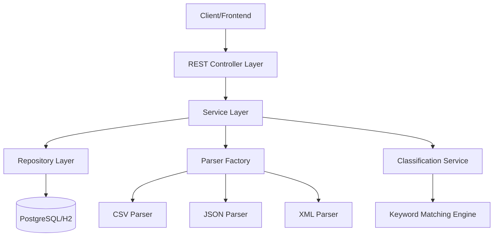

# Customer Support Ticket Management System

A comprehensive Spring Boot application for managing customer support tickets with multi-format import capabilities, intelligent auto-classification, and RESTful APIs.

## Features

- **Multi-Format Import**: Import tickets from CSV, JSON, and XML files
- **Auto-Classification**: Keyword-based intelligent classification of ticket categories and priorities
- **RESTful API**: Complete CRUD operations with filtering capabilities
- **Validation**: Multi-layer validation (Bean Validation + Custom validators)
- **Data Persistence**: PostgreSQL for production, H2 for testing
- **OpenAPI Documentation**: Interactive Swagger UI for API exploration
- **High Test Coverage**: >85% code coverage with comprehensive unit and integration tests

## Architecture



## Technology Stack

- **Framework**: Spring Boot 3.2.2
- **Language**: Java 17
- **Build Tool**: Maven
- **Database**: PostgreSQL (production), H2 (testing)
- **File Parsers**: Apache Commons CSV, Jackson (JSON/XML)
- **Testing**: JUnit 5, MockMvc, Testcontainers
- **Documentation**: SpringDoc OpenAPI (Swagger)
- **Code Coverage**: JaCoCo (>85% enforcement)

## Prerequisites

- Java 17 or higher
- Maven 3.6+
- PostgreSQL 12+ (for production use)

## Installation

1. Clone the repository:
```bash
git clone <repository-url>
cd homework-2
```

2. Set up PostgreSQL database:
```sql
CREATE DATABASE ticketdb;
CREATE USER postgres WITH PASSWORD 'postgres';
GRANT ALL PRIVILEGES ON DATABASE ticketdb TO postgres;
```

3. Update database configuration in `src/main/resources/application.yml` if needed:
```yaml
spring:
  datasource:
    url: jdbc:postgresql://localhost:5432/ticketdb
    username: postgres
    password: postgres
```

4. Build the project:
```bash
mvn clean install
```

## Running the Application

### Development Mode

```bash
mvn spring-boot:run
```

The application will start on `http://localhost:8080`

### Production Mode

```bash
java -jar target/ticket-system-1.0.0.jar
```

## Testing

### Run all tests:
```bash
mvn test
```

### Run specific test class:
```bash
mvn test -Dtest=TicketControllerTest
```

### Generate coverage report:
```bash
mvn clean test jacoco:report
```

View the coverage report at: `target/site/jacoco/index.html`

## API Endpoints

| Method | Endpoint | Description |
|--------|----------|-------------|
| POST | `/tickets` | Create a new ticket |
| POST | `/tickets/import` | Bulk import tickets from file |
| GET | `/tickets` | Get all tickets (with optional filters) |
| GET | `/tickets/{id}` | Get ticket by ID |
| PUT | `/tickets/{id}` | Update ticket |
| DELETE | `/tickets/{id}` | Delete ticket |
| POST | `/tickets/{id}/auto-classify` | Auto-classify ticket |

### Interactive API Documentation

Access Swagger UI at: `http://localhost:8080/swagger-ui.html`

## Quick Start Examples

### Create a ticket:
```bash
curl -X POST http://localhost:8080/tickets \
  -H "Content-Type: application/json" \
  -d '{
    "customerId": "C001",
    "customerEmail": "user@example.com",
    "customerName": "John Doe",
    "subject": "Cannot login to account",
    "description": "I forgot my password and the reset link is not working",
    "autoClassify": true
  }'
```

### Import tickets from CSV:
```bash
curl -X POST http://localhost:8080/tickets/import \
  -F "file=@data/sample_tickets.csv" \
  -F "format=csv" \
  -F "autoClassify=true"
```

### List all tickets:
```bash
curl http://localhost:8080/tickets
```

### Filter tickets:
```bash
curl "http://localhost:8080/tickets?category=BUG_REPORT&priority=URGENT"
```

## Project Structure

```
homework-2/
├── pom.xml                          # Maven configuration
├── src/
│   ├── main/
│   │   ├── java/com/workshop/ticketsystem/
│   │   │   ├── TicketSystemApplication.java
│   │   │   ├── controller/          # REST controllers
│   │   │   │   ├── TicketController.java
│   │   │   │   └── GlobalExceptionHandler.java
│   │   │   ├── service/             # Business logic
│   │   │   │   ├── TicketService.java
│   │   │   │   ├── TicketServiceImpl.java
│   │   │   │   ├── ClassificationService.java
│   │   │   │   ├── ClassificationServiceImpl.java
│   │   │   │   ├── ImportService.java
│   │   │   │   └── ImportServiceImpl.java
│   │   │   ├── parser/              # File parsers
│   │   │   │   ├── FileParser.java
│   │   │   │   ├── CsvFileParser.java
│   │   │   │   ├── JsonFileParser.java
│   │   │   │   ├── XmlFileParser.java
│   │   │   │   └── ParserFactory.java
│   │   │   ├── repository/          # Data access
│   │   │   │   ├── TicketRepository.java
│   │   │   │   └── ClassificationLogRepository.java
│   │   │   ├── entity/              # JPA entities
│   │   │   │   ├── Ticket.java
│   │   │   │   ├── TicketMetadata.java
│   │   │   │   └── ClassificationLog.java
│   │   │   ├── dto/                 # Data transfer objects
│   │   │   │   ├── CreateTicketRequest.java
│   │   │   │   ├── UpdateTicketRequest.java
│   │   │   │   ├── TicketDto.java
│   │   │   │   ├── ClassificationResult.java
│   │   │   │   ├── ImportSummaryResponse.java
│   │   │   │   └── ErrorResponse.java
│   │   │   ├── enums/               # Enumerations
│   │   │   │   ├── TicketCategory.java
│   │   │   │   ├── TicketPriority.java
│   │   │   │   ├── TicketStatus.java
│   │   │   │   ├── TicketSource.java
│   │   │   │   └── DeviceType.java
│   │   │   └── exception/           # Custom exceptions
│   │   │       ├── TicketNotFoundException.java
│   │   │       ├── ValidationException.java
│   │   │       ├── FileParseException.java
│   │   │       └── InvalidTicketException.java
│   │   └── resources/
│   │       ├── application.yml
│   │       └── application-test.yml
│   └── test/
│       ├── java/com/workshop/ticketsystem/
│       │   ├── controller/
│       │   │   └── TicketControllerTest.java
│       │   ├── service/
│       │   │   └── ClassificationServiceTest.java
│       │   ├── parser/
│       │   │   ├── CsvFileParserTest.java
│       │   │   ├── JsonFileParserTest.java
│       │   │   └── XmlFileParserTest.java
│       │   └── entity/
│       │       └── TicketModelTest.java
│       └── resources/
│           └── application-test.yml
├── data/                            # Sample data files
│   ├── sample_tickets.csv           # 50 sample tickets
│   ├── sample_tickets.json          # 20 sample tickets
│   └── sample_tickets.xml           # 30 sample tickets
└── docs/                            # Documentation
    ├── API_REFERENCE.md
    ├── ARCHITECTURE.md
    └── TESTING_GUIDE.md
```

## Configuration

### Application Properties

Key configuration options in `application.yml`:

```yaml
spring:
  servlet:
    multipart:
      max-file-size: 10MB        # Maximum file upload size
      max-request-size: 10MB     # Maximum request size

server:
  port: 8080                      # Application port

logging:
  level:
    com.workshop.ticketsystem: DEBUG
```

## Classification Algorithm

The system uses a keyword-based classification algorithm:

- **Category Classification**: Matches keywords in ticket subject/description to predefined category keywords
- **Priority Classification**: Determines urgency based on priority-related keywords
- **Confidence Score**: Calculated based on number of matching keywords
- **Classification Log**: All classification decisions are logged with reasoning

## Contributing

1. Fork the repository
2. Create a feature branch
3. Make your changes with tests
4. Ensure >85% code coverage: `mvn clean test jacoco:report`
5. Submit a pull request

## License

This project is part of an AI workshop assignment.

## Support

For questions or issues, please open an issue in the repository.
