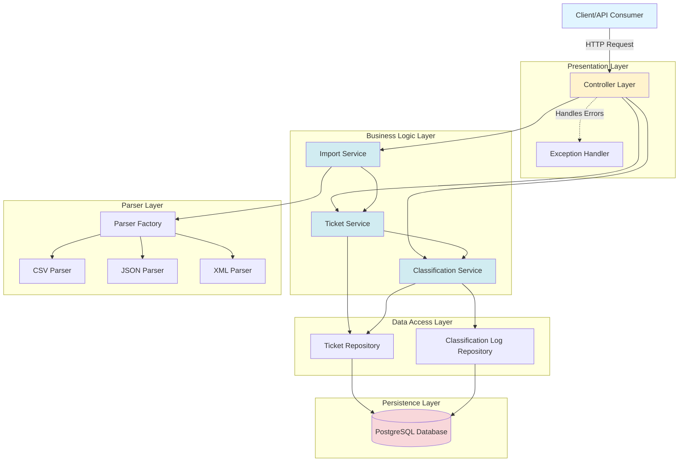
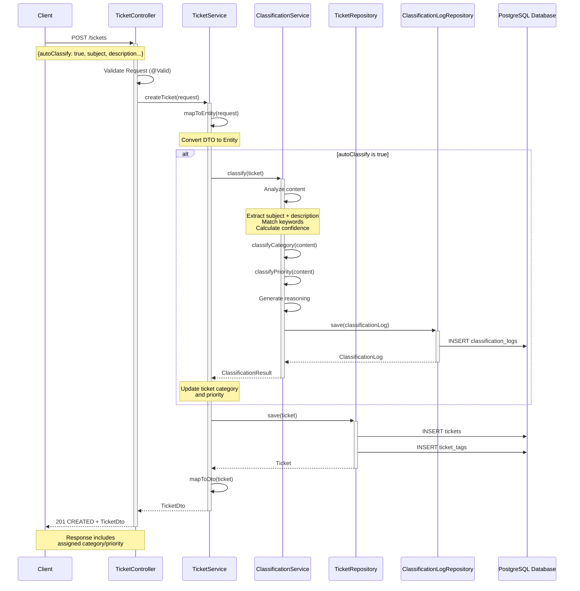
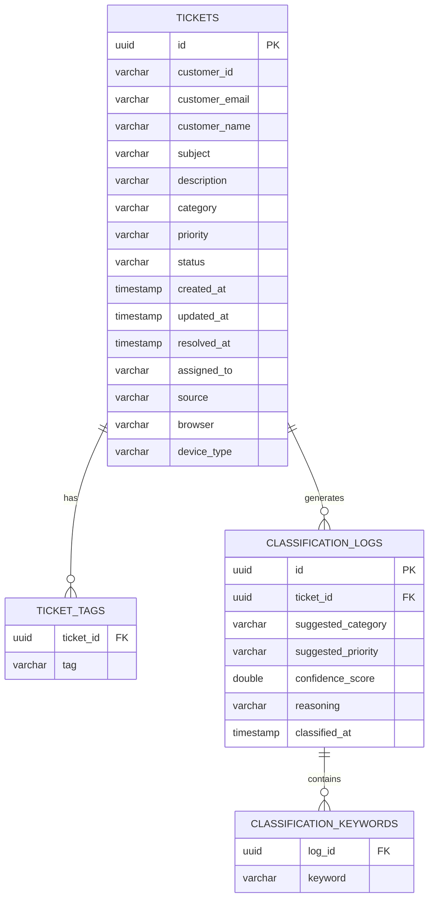

# System Architecture Documentation

## Table of Contents
1. [System Overview](#system-overview)
2. [High-Level Architecture](#high-level-architecture)
3. [Component Architecture](#component-architecture)
4. [Sequence Diagram](#sequence-diagram)
5. [Database Schema](#database-schema)
6. [Design Decisions](#design-decisions)
7. [Design Patterns Used](#design-patterns-used)
8. [Security Considerations](#security-considerations)
9. [Performance Optimizations](#performance-optimizations)

---

## System Overview

The Customer Support Ticket Management System is a comprehensive Spring Boot application designed to streamline the handling of customer support requests. The system provides RESTful APIs for creating, updating, retrieving, and managing support tickets with intelligent auto-classification capabilities.

### Key Features
- **Multi-format Import**: Support for CSV, JSON, and XML file imports
- **Auto-classification**: Keyword-based intelligent categorization and priority assignment
- **Flexible Filtering**: Query tickets by category, priority, and status
- **Metadata Tracking**: Embedded metadata for source, browser, and device type
- **Validation**: Comprehensive input validation using Jakarta Bean Validation
- **API Documentation**: Interactive Swagger UI documentation

### Technology Stack
- **Framework**: Spring Boot 3.2.2
- **Language**: Java 17
- **Database**: PostgreSQL
- **Build Tool**: Maven
- **ORM**: Spring Data JPA with Hibernate
- **API Documentation**: SpringDoc OpenAPI 3
- **Testing**: JUnit 5, Testcontainers

---

## High-Level Architecture

The system follows a layered architecture pattern with clear separation of concerns:



---

## Component Architecture

### Controller Layer (REST API Endpoints)

**Location**: `com.workshop.ticketsystem.controller`

The Controller layer exposes RESTful endpoints for client interaction. It handles HTTP requests, delegates business logic to services, and formats responses.

**Key Components**:
- **TicketController**: Main REST controller managing all ticket-related endpoints
  - `POST /tickets` - Create a new ticket
  - `POST /tickets/import` - Bulk import tickets from file
  - `GET /tickets` - Retrieve all tickets with optional filtering
  - `GET /tickets/{id}` - Get ticket by ID
  - `PUT /tickets/{id}` - Update existing ticket
  - `DELETE /tickets/{id}` - Delete ticket
  - `POST /tickets/{id}/auto-classify` - Trigger auto-classification

- **GlobalExceptionHandler**: Centralized exception handling using `@ControllerAdvice`
  - Handles `TicketNotFoundException`
  - Handles `ValidationException`
  - Handles `FileParseException`
  - Returns standardized error responses

**Responsibilities**:
- Request validation using `@Valid` annotations
- HTTP status code management
- DTO transformation
- Error response formatting

---

### Service Layer (Business Logic)

**Location**: `com.workshop.ticketsystem.service`

The Service layer contains the core business logic, orchestrates operations across multiple repositories, and implements domain-specific rules.

**Key Components**:

#### TicketService
- **Interface**: `TicketService`
- **Implementation**: `TicketServiceImpl`
- **Responsibilities**:
  - Ticket CRUD operations
  - DTO ↔ Entity mapping
  - Filtering logic coordination
  - Integration with ClassificationService for auto-classification

#### ClassificationService
- **Interface**: `ClassificationService`
- **Implementation**: `ClassificationServiceImpl`
- **Responsibilities**:
  - Keyword-based category detection
  - Priority level determination
  - Confidence score calculation
  - Classification log persistence
  - Reasoning generation

**Classification Algorithm**:
- Analyzes ticket subject and description
- Matches against predefined keyword sets
- Calculates confidence scores based on keyword frequency
- Supports 6 categories: Account Access, Technical Issue, Billing Question, Feature Request, Bug Report, Other
- Supports 4 priority levels: Urgent, High, Medium, Low

#### ImportService
- **Interface**: `ImportService`
- **Implementation**: `ImportServiceImpl`
- **Responsibilities**:
  - File format detection
  - Parser selection via ParserFactory
  - Batch ticket processing
  - Validation error aggregation
  - Import summary generation

---

### Parser Layer (CSV/JSON/XML Parsing)

**Location**: `com.workshop.ticketsystem.parser`

The Parser layer implements the Strategy pattern to handle multiple file formats uniformly.

**Key Components**:

#### FileParser Interface
Defines the contract for all parsers:
```java
List<CreateTicketRequest> parse(MultipartFile file) throws IOException;
String getSupportedFormat();
```

#### Concrete Parsers
- **CsvFileParser**: Uses Apache Commons CSV for parsing CSV files
- **JsonFileParser**: Uses Jackson for JSON deserialization
- **XmlFileParser**: Uses Jackson XML for XML parsing

#### ParserFactory
- Implements Factory pattern
- Maintains a registry of available parsers
- Returns appropriate parser based on format string
- Throws `FileParseException` for unsupported formats

**Supported Formats**: CSV, JSON, XML

---

### Repository Layer (Data Access)

**Location**: `com.workshop.ticketsystem.repository`

The Repository layer provides data access abstraction using Spring Data JPA.

**Key Components**:

#### TicketRepository
- Extends `JpaRepository<Ticket, UUID>`
- **Query Methods**:
  - `findByCategory(TicketCategory category)`
  - `findByPriority(TicketPriority priority)`
  - `findByStatus(TicketStatus status)`
  - `findByFilters(category, priority, status)` - Custom JPQL query with optional parameters
  - `findByCustomerId(String customerId)`
  - `findByAssignedTo(String assignedTo)`

#### ClassificationLogRepository
- Extends `JpaRepository<ClassificationLog, UUID>`
- Stores classification history for audit and analysis

**Benefits**:
- Automatic CRUD operations
- Type-safe query methods
- Transaction management
- No boilerplate SQL code

---

### Entity Layer (Domain Models)

**Location**: `com.workshop.ticketsystem.entity`

The Entity layer represents the domain model and database schema.

**Key Entities**:

#### Ticket
- Primary entity representing a support ticket
- **Fields**: id, customerId, customerEmail, customerName, subject, description, category, priority, status, createdAt, updatedAt, resolvedAt, assignedTo, tags, metadata
- **Lifecycle Callbacks**:
  - `@PrePersist`: Sets default values for status, category, priority
  - `@PreUpdate`: Auto-sets resolvedAt when status changes to RESOLVED

#### ClassificationLog
- Audit log for classification operations
- **Fields**: id, ticketId, suggestedCategory, suggestedPriority, confidenceScore, reasoning, keywordsFound, classifiedAt
- Enables tracking classification accuracy over time

#### TicketMetadata (Embeddable)
- **Fields**: source (EMAIL, WEB, PHONE, CHAT), browser, deviceType (DESKTOP, MOBILE, TABLET)
- Embedded within Ticket entity
- Optional contextual information

---

## Sequence Diagram

### Creating a Ticket with Auto-Classification



---

## Database Schema

### Tables Overview

The system uses PostgreSQL with the following core tables:

#### 1. tickets

Primary table storing all ticket information.

| Column | Type | Constraints | Description |
|--------|------|-------------|-------------|
| id | UUID | PRIMARY KEY | Unique ticket identifier |
| customer_id | VARCHAR(255) | NOT NULL | Customer reference ID |
| customer_email | VARCHAR(255) | NOT NULL | Customer email address (validated) |
| customer_name | VARCHAR(255) | NOT NULL | Customer full name |
| subject | VARCHAR(200) | NOT NULL | Ticket subject/title |
| description | VARCHAR(2000) | NOT NULL | Detailed ticket description |
| category | VARCHAR(50) | NOT NULL | Enum: ACCOUNT_ACCESS, TECHNICAL_ISSUE, BILLING_QUESTION, FEATURE_REQUEST, BUG_REPORT, OTHER |
| priority | VARCHAR(50) | NOT NULL | Enum: URGENT, HIGH, MEDIUM, LOW |
| status | VARCHAR(50) | NOT NULL | Enum: NEW, IN_PROGRESS, WAITING_CUSTOMER, RESOLVED, CLOSED |
| created_at | TIMESTAMP | NOT NULL | Auto-generated creation timestamp |
| updated_at | TIMESTAMP | NOT NULL | Auto-updated modification timestamp |
| resolved_at | TIMESTAMP | NULL | Timestamp when status changed to RESOLVED |
| assigned_to | VARCHAR(255) | NULL | Assignee identifier |
| source | VARCHAR(50) | NULL | Embedded: EMAIL, WEB, PHONE, CHAT |
| browser | VARCHAR(255) | NULL | Embedded: Browser information |
| device_type | VARCHAR(50) | NULL | Embedded: DESKTOP, MOBILE, TABLET |

**Indexes**:
- Primary key index on `id`
- Recommended indexes: `category`, `priority`, `status`, `customer_id`, `assigned_to`, `created_at`

---

#### 2. classification_logs

Audit table tracking all classification operations.

| Column | Type | Constraints | Description |
|--------|------|-------------|-------------|
| id | UUID | PRIMARY KEY | Unique log identifier |
| ticket_id | UUID | NOT NULL | Foreign key reference to tickets.id |
| suggested_category | VARCHAR(50) | NOT NULL | Classification result category |
| suggested_priority | VARCHAR(50) | NOT NULL | Classification result priority |
| confidence_score | DOUBLE | NOT NULL | 0.0-1.0 confidence level |
| reasoning | VARCHAR(1000) | NULL | Explanation of classification |
| classified_at | TIMESTAMP | NOT NULL | Timestamp of classification |

**Indexes**:
- Primary key index on `id`
- Foreign key index on `ticket_id`

**Relationships**:
- One-to-many relationship with tickets (one ticket can have multiple classification logs)
- No foreign key constraint enforced (allows historical data retention)

---

#### 3. ticket_tags

Junction table for storing ticket tags (many-to-many relationship).

| Column | Type | Constraints | Description |
|--------|------|-------------|-------------|
| ticket_id | UUID | FOREIGN KEY | References tickets.id |
| tag | VARCHAR(255) | NOT NULL | Tag value |

**Indexes**:
- Composite index on `(ticket_id, tag)`
- Foreign key constraint: ON DELETE CASCADE

**Structure**: `@ElementCollection` in JPA creates this table automatically

---

#### 4. classification_keywords

Junction table for storing keywords found during classification.

| Column | Type | Constraints | Description |
|--------|------|-------------|-------------|
| log_id | UUID | FOREIGN KEY | References classification_logs.id |
| keyword | VARCHAR(255) | NOT NULL | Matched keyword |

**Indexes**:
- Composite index on `(log_id, keyword)`
- Foreign key constraint: ON DELETE CASCADE

---

### Entity Relationship Diagram



---

## Design Decisions

### 1. Why Maven over Gradle?

**Decision**: Use Maven as the build tool

**Rationale**:
- **Industry Standard**: Maven is widely adopted in enterprise Java environments
- **Convention over Configuration**: Follows standardized project structure and lifecycle
- **Dependency Management**: Excellent dependency resolution and conflict management
- **IDE Support**: Superior out-of-the-box support in IntelliJ IDEA, Eclipse, and VS Code
- **Plugin Ecosystem**: Mature plugin ecosystem (JaCoCo, Surefire, Spring Boot)
- **Learning Curve**: Lower learning curve for developers familiar with XML-based configuration
- **Stability**: More predictable builds with declarative configuration

**Trade-offs**:
- Gradle offers better performance for large multi-module projects
- Gradle provides more flexibility with Groovy/Kotlin DSL
- Maven XML can be verbose for complex configurations

---

### 2. Why UUID over Long IDs?

**Decision**: Use UUID as primary key for tickets and logs

**Rationale**:
- **Distributed System Ready**: UUIDs allow generation without database coordination
- **Security**: Non-sequential IDs prevent enumeration attacks (can't guess ticket URLs)
- **Merge Safety**: Eliminates ID conflicts when merging databases or microservices
- **Global Uniqueness**: Guaranteed uniqueness across systems and environments
- **Future-Proof**: Supports horizontal scaling and distributed architectures

**Trade-offs**:
- Larger storage footprint (128-bit vs 64-bit for Long)
- Slightly slower index operations compared to sequential Long IDs
- Less human-readable in logs and debugging

**Implementation**:
```java
@Id
@GeneratedValue(strategy = GenerationType.UUID)
private UUID id;
```

---

### 3. Why Keyword-Based Classification Instead of ML?

**Decision**: Implement rule-based keyword matching for classification

**Rationale**:
- **Simplicity**: No training data required; immediate deployment
- **Transparency**: Easy to understand and explain classification decisions
- **Maintainability**: Simple to update keywords without retraining models
- **Performance**: Lightning-fast classification with no model inference overhead
- **Resource Efficiency**: No GPU/ML infrastructure required
- **Auditability**: Clear reasoning for every classification decision
- **Good Enough**: Achieves acceptable accuracy for common support scenarios

**Limitations**:
- Less accurate than trained ML models for complex cases
- Cannot learn from new patterns automatically
- Limited handling of synonyms and context
- May struggle with ambiguous or multi-topic tickets

**Future Enhancement Path**:
- Keyword-based system provides baseline for ML comparison
- Classification logs create training dataset for future ML implementation
- Can gradually transition to hybrid approach (keywords + ML)

---

### 4. Why Synchronous Import Instead of Async?

**Decision**: Process file imports synchronously in the request thread

**Rationale**:
- **Simplicity**: No message queue or job scheduler infrastructure required
- **Immediate Feedback**: Client receives complete import summary in response
- **Error Handling**: Easier to return detailed per-record error messages
- **Small Scale**: Suitable for files with hundreds to low thousands of records
- **Transactional**: Single transaction ensures all-or-nothing semantics per file

**Limitations**:
- HTTP timeout risk for very large files (>10,000 records)
- Blocking operation ties up server thread during processing
- No progress tracking for long-running imports

**Mitigation Strategies**:
- File size limit: 10MB (configured in application.yml)
- Reasonable timeout expectations
- Validation before processing to fail fast

**Future Enhancement**:
```java
// Potential async implementation
@Async
public CompletableFuture<ImportSummaryResponse> importTicketsAsync(...)
```

---

### 5. Embedded Metadata vs Separate Table

**Decision**: Use `@Embeddable` for ticket metadata (source, browser, deviceType)

**Rationale**:
- **Cohesion**: Metadata is tightly coupled to ticket lifecycle
- **Performance**: No JOIN required; metadata loaded with ticket in single query
- **Simplicity**: Fewer tables and relationships to manage
- **Atomic Updates**: Metadata updates are part of ticket update transaction
- **Access Pattern**: Metadata is always queried with ticket, never independently

**Trade-offs**:
- Cannot query metadata independently without loading tickets
- Cannot establish foreign key relationships to metadata
- Metadata schema changes require ticket table migration

**When to Use Separate Table**:
- If metadata needs independent querying
- If metadata has one-to-many relationships
- If metadata is shared across multiple entities

---

## Design Patterns Used

### 1. Strategy Pattern (File Parsers)

**Implementation**: `FileParser` interface with multiple implementations

**Purpose**: Define a family of algorithms (CSV, JSON, XML parsing) and make them interchangeable.

```java
public interface FileParser {
    List<CreateTicketRequest> parse(MultipartFile file) throws IOException;
    String getSupportedFormat();
}

// Concrete strategies
@Component
public class CsvFileParser implements FileParser { ... }

@Component
public class JsonFileParser implements FileParser { ... }

@Component
public class XmlFileParser implements FileParser { ... }
```

**Benefits**:
- Adding new file formats requires no changes to existing code
- Each parser encapsulates its parsing logic
- Easy to test parsers in isolation

---

### 2. Factory Pattern (Parser Factory)

**Implementation**: `ParserFactory` class

**Purpose**: Encapsulate parser instantiation and selection logic.

```java
@Component
public class ParserFactory {
    private final Map<String, FileParser> parsers;

    public ParserFactory(List<FileParser> parserList) {
        // Spring auto-injects all FileParser implementations
        this.parsers = parserList.stream()
            .collect(Collectors.toMap(
                parser -> parser.getSupportedFormat().toLowerCase(),
                Function.identity()
            ));
    }

    public FileParser getParser(String format) {
        FileParser parser = parsers.get(format.toLowerCase());
        if (parser == null) {
            throw new FileParseException("Unsupported format: " + format);
        }
        return parser;
    }
}
```

**Benefits**:
- Centralized parser creation logic
- Leverages Spring's dependency injection
- Easy to add new parsers without modifying factory

---

### 3. Service Layer Pattern

**Implementation**: Separate service interfaces and implementations

**Purpose**: Encapsulate business logic and provide transaction boundaries.

```java
@Service
@RequiredArgsConstructor
public class TicketServiceImpl implements TicketService {
    private final TicketRepository ticketRepository;
    private final ClassificationService classificationService;

    @Transactional
    public TicketDto createTicket(CreateTicketRequest request) {
        // Business logic orchestration
    }
}
```

**Benefits**:
- Clear separation between web layer and business logic
- Transaction management via `@Transactional`
- Reusable business logic across multiple controllers
- Easy to mock services for controller testing

---

### 4. Repository Pattern

**Implementation**: Spring Data JPA repositories

**Purpose**: Abstract data access logic and provide consistent interface.

```java
@Repository
public interface TicketRepository extends JpaRepository<Ticket, UUID> {
    List<Ticket> findByCategory(TicketCategory category);

    @Query("SELECT t FROM Ticket t WHERE (:category IS NULL OR t.category = :category)")
    List<Ticket> findByFilters(@Param("category") TicketCategory category, ...);
}
```

**Benefits**:
- No boilerplate CRUD code
- Type-safe query methods
- Automatic transaction management
- Easy to switch database implementations

---

### 5. DTO Pattern (Data Transfer Objects)

**Implementation**: Separate request/response DTOs

**Purpose**: Decouple API contracts from internal domain models.

**DTOs**:
- `CreateTicketRequest`: Input for ticket creation
- `UpdateTicketRequest`: Input for ticket updates
- `TicketDto`: Output representation of tickets
- `ClassificationResult`: Classification output
- `ImportSummaryResponse`: Bulk import results

**Benefits**:
- API versioning without changing entities
- Prevent over-posting attacks
- Validation at API boundary
- Hide internal implementation details

---

## Security Considerations

### Current Implementation

The current implementation includes basic security measures:

1. **Input Validation**:
   - Jakarta Bean Validation annotations (`@NotBlank`, `@Email`, `@Size`)
   - Custom validation in parsers
   - Exception handling for malformed input

2. **SQL Injection Prevention**:
   - JPA/Hibernate parameterized queries
   - No raw SQL concatenation
   - Spring Data JPA query methods

3. **File Upload Safety**:
   - File size limits (10MB max)
   - Format validation
   - Exception handling for malicious files

---

### Future Enhancements

#### 1. Authentication & Authorization

**Recommendation**: Implement Spring Security with JWT tokens

```java
@Configuration
@EnableWebSecurity
public class SecurityConfig {

    @Bean
    public SecurityFilterChain filterChain(HttpSecurity http) {
        http
            .authorizeHttpRequests(auth -> auth
                .requestMatchers("/tickets/**").authenticated()
                .requestMatchers("/api-docs/**").permitAll()
            )
            .oauth2ResourceServer(OAuth2ResourceServerConfigurer::jwt);
        return http.build();
    }
}
```

**Roles**:
- **CUSTOMER**: Can create tickets, view own tickets
- **AGENT**: Can view/update all tickets, assign tickets
- **ADMIN**: Full access including deletion and system configuration

---

#### 2. Rate Limiting

**Recommendation**: Implement request throttling to prevent abuse

```java
@Component
public class RateLimitingFilter extends OncePerRequestFilter {

    private final RateLimiter rateLimiter = RateLimiter.create(100.0); // 100 req/sec

    @Override
    protected void doFilterInternal(HttpServletRequest request,
                                    HttpServletResponse response,
                                    FilterChain filterChain) {
        if (!rateLimiter.tryAcquire()) {
            response.setStatus(HttpStatus.TOO_MANY_REQUESTS.value());
            return;
        }
        filterChain.doFilter(request, response);
    }
}
```

**Strategies**:
- Per-IP rate limiting
- Per-user rate limiting (after authentication)
- Different limits for different endpoints

---

#### 3. Input Sanitization

**Recommendation**: Sanitize HTML and prevent XSS attacks

```java
public class SanitizationUtil {
    private static final Policy POLICY = new HtmlPolicyBuilder()
        .allowElements("b", "i", "u")
        .toFactory();

    public static String sanitize(String input) {
        return POLICY.sanitize(input);
    }
}
```

**Apply to**:
- Ticket subject and description
- Customer names
- Tags
- Any user-generated content

---

#### 4. Additional Measures

- **HTTPS Only**: Force secure connections in production
- **CORS Configuration**: Restrict allowed origins
- **Content Security Policy**: Add CSP headers
- **Audit Logging**: Log all security-relevant events
- **Sensitive Data Masking**: Mask email addresses in logs
- **API Key Authentication**: For service-to-service communication

---

## Performance Optimizations

### Current Optimizations

#### 1. Database Indexes

**Implemented Indexes**:
- Primary key indexes (automatic with `@Id`)
- Foreign key indexes (automatic with `@JoinColumn`)

**Recommended Additional Indexes**:

```sql
-- Performance indexes for common queries
CREATE INDEX idx_tickets_category ON tickets(category);
CREATE INDEX idx_tickets_priority ON tickets(priority);
CREATE INDEX idx_tickets_status ON tickets(status);
CREATE INDEX idx_tickets_customer_id ON tickets(customer_id);
CREATE INDEX idx_tickets_assigned_to ON tickets(assigned_to);
CREATE INDEX idx_tickets_created_at ON tickets(created_at DESC);

-- Composite index for filtering
CREATE INDEX idx_tickets_cat_pri_status ON tickets(category, priority, status);
```

---

#### 2. Pagination Support

**Current State**: Not implemented (loads all records)

**Recommendation**: Add pagination to list endpoints

```java
@GetMapping
public ResponseEntity<Page<TicketDto>> getAllTickets(
        @RequestParam(required = false) TicketCategory category,
        @RequestParam(required = false) TicketPriority priority,
        @RequestParam(required = false) TicketStatus status,
        @RequestParam(defaultValue = "0") int page,
        @RequestParam(defaultValue = "20") int size) {

    Pageable pageable = PageRequest.of(page, size, Sort.by("createdAt").descending());
    Page<TicketDto> tickets = ticketService.getAllTickets(category, priority, status, pageable);
    return ResponseEntity.ok(tickets);
}
```

**Benefits**:
- Reduced memory consumption
- Faster response times
- Better user experience for large datasets

---

#### 3. Batch Inserts

**Current Implementation**: Individual saves in loop

**Optimization**: Use batch processing for imports

```java
@Transactional
public ImportSummaryResponse importTickets(MultipartFile file, String format, boolean autoClassify) {
    List<CreateTicketRequest> tickets = parser.parse(file);

    // Batch configuration in application.yml
    // spring.jpa.properties.hibernate.jdbc.batch_size=50

    List<Ticket> entities = tickets.stream()
        .map(this::mapToEntity)
        .collect(Collectors.toList());

    ticketRepository.saveAll(entities); // Hibernate batches internally
}
```

**Configuration**:
```yaml
spring:
  jpa:
    properties:
      hibernate:
        jdbc:
          batch_size: 50
        order_inserts: true
        order_updates: true
```

---

#### 4. Connection Pooling

**Implementation**: HikariCP (included with Spring Boot)

**Configuration**:
```yaml
spring:
  datasource:
    hikari:
      maximum-pool-size: 20
      minimum-idle: 5
      connection-timeout: 30000
      idle-timeout: 600000
      max-lifetime: 1800000
```

**Benefits**:
- Reduced connection establishment overhead
- Efficient connection reuse
- Better handling of concurrent requests

---

### Additional Optimization Opportunities

#### 5. Caching

**Recommendation**: Cache frequently accessed, rarely changing data

```java
@Service
@CacheConfig(cacheNames = "tickets")
public class TicketServiceImpl implements TicketService {

    @Cacheable(key = "#id")
    public TicketDto getTicketById(UUID id) {
        // ...
    }

    @CacheEvict(key = "#id")
    public void deleteTicket(UUID id) {
        // ...
    }
}
```

**Cache Candidates**:
- Individual ticket lookups by ID
- Category/priority statistics
- Classification keyword maps

---

#### 6. Lazy Loading

**Recommendation**: Configure lazy loading for collections

```java
@Entity
public class Ticket {
    @ElementCollection(fetch = FetchType.LAZY)
    @CollectionTable(name = "ticket_tags")
    private List<String> tags = new ArrayList<>();
}
```

**Benefits**:
- Only load tags when explicitly accessed
- Reduced initial query size
- Better performance for list endpoints

---

#### 7. Database Query Optimization

**Recommendation**: Use `@EntityGraph` to prevent N+1 queries

```java
@EntityGraph(attributePaths = {"tags", "metadata"})
List<Ticket> findAllWithTags();
```

**Monitor**:
- Enable Hibernate SQL logging in development
- Use query performance tools (pgAdmin, EXPLAIN ANALYZE)
- Track slow query logs in production

---

#### 8. Asynchronous Processing

**Recommendation**: Move long-running tasks to background jobs

```java
@Async
@Transactional
public CompletableFuture<Void> processClassificationBatch(List<UUID> ticketIds) {
    ticketIds.forEach(id -> {
        Ticket ticket = ticketRepository.findById(id).orElseThrow();
        classificationService.classify(ticket);
    });
    return CompletableFuture.completedFuture(null);
}
```

**Use Cases**:
- Bulk classification operations
- Large file imports
- Report generation

---

## Conclusion

This architecture provides a solid foundation for a scalable ticket management system. The layered approach ensures maintainability, while design patterns promote code reuse and flexibility. Future enhancements should focus on security hardening, performance optimization through caching and pagination, and potential migration to microservices for horizontal scaling.

For questions or suggestions regarding this architecture, please contact the development team.
