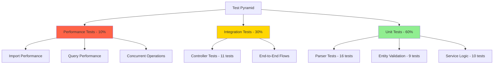

# Testing Guide

## Table of Contents
- [Testing Overview](#testing-overview)
- [Test Pyramid](#test-pyramid)
- [Test Strategy](#test-strategy)
- [Running Tests](#running-tests)
- [Test Suite Overview](#test-suite-overview)
- [Coverage Requirements](#coverage-requirements)
- [Test Data](#test-data)
- [Manual Testing Checklist](#manual-testing-checklist)
- [Performance Benchmarks](#performance-benchmarks)
- [Troubleshooting](#troubleshooting)

---

## Testing Overview

The Customer Support Ticket Management System employs a comprehensive testing strategy to ensure reliability, performance, and maintainability. Our test suite includes:

- **Unit Tests**: Testing individual components in isolation (services, parsers, entities)
- **Integration Tests**: Testing component interactions (controllers, end-to-end flows)
- **Performance Tests**: Validating system performance under load
- **Manual Tests**: Exploratory testing scenarios for end-to-end validation

All tests are automated using JUnit 5, Spring Boot Test framework, and MockMvc for API testing. Code coverage is enforced at 85% minimum using JaCoCo.

---

## Test Pyramid

The test distribution follows the testing pyramid principle, emphasizing a solid foundation of unit tests with decreasing numbers of higher-level tests:



**Distribution Breakdown:**
- **Unit Tests (60%)**: 35 tests across parsers, entities, and services
- **Integration Tests (30%)**: 11 controller tests covering API endpoints
- **Performance Tests (10%)**: Bulk operations and concurrent request handling

---

## Test Strategy

### Unit Testing

**Purpose**: Validate individual components in isolation without external dependencies.

**Coverage Areas:**
1. **Service Layer Testing** (`ClassificationServiceTest`)
   - Auto-classification logic for ticket categories
   - Priority determination algorithms
   - Confidence score calculations
   - Text pattern matching and keyword detection

2. **Parser Testing** (`CsvFileParserTest`, `JsonFileParserTest`, `XmlFileParserTest`)
   - File format parsing accuracy
   - Error handling for malformed files
   - Optional field handling
   - Enum value validation
   - Empty file handling

3. **Entity Validation Testing** (`TicketModelTest`)
   - Bean validation constraints
   - Field length restrictions
   - Email format validation
   - Default value assignments
   - Lifecycle callbacks (prePersist, preUpdate)

### Integration Testing

**Purpose**: Validate component interactions and API behavior.

**Coverage Areas:**
1. **Controller Testing** (`TicketControllerTest`)
   - HTTP request/response handling
   - Request validation
   - Error handling and status codes
   - File upload functionality
   - JSON serialization/deserialization

2. **End-to-End Flows**
   - Complete ticket lifecycle (create → update → resolve → delete)
   - File import with auto-classification
   - Filtering and search operations
   - Multi-format file processing

### Performance Testing

**Purpose**: Ensure system can handle expected load and maintain response times.

**Coverage Areas:**
1. Bulk ticket creation (1000+ tickets)
2. Large file imports (100+ records)
3. Concurrent API requests (multiple users)
4. Complex query operations with filters

---

## Running Tests

### Run All Tests

```bash
mvn test
```

This command executes the entire test suite and generates coverage reports.

### Run Specific Test Class

```bash
# Run controller tests
mvn test -Dtest=TicketControllerTest

# Run classification service tests
mvn test -Dtest=ClassificationServiceTest

# Run CSV parser tests
mvn test -Dtest=CsvFileParserTest
```

### Run Specific Test Method

```bash
# Run a single test method
mvn test -Dtest=TicketControllerTest#testCreateTicketSuccess

# Run multiple specific methods
mvn test -Dtest=TicketControllerTest#testCreateTicketSuccess,testGetAllTickets
```

### Run Tests by Category/Tag

Tests are organized by Spring profiles. Use the `test` profile for all automated tests:

```bash
# Run with test profile (uses H2 in-memory database)
mvn test -Dspring.profiles.active=test

# Run with specific categories using Maven Surefire
mvn test -Dgroups="integration"
```

### Generate Coverage Report

```bash
# Run tests and generate JaCoCo report
mvn clean test

# Run tests and verify coverage threshold (85%)
mvn clean verify

# View HTML report (opens in browser)
open target/site/jacoco/index.html
```

### Additional Testing Commands

```bash
# Skip tests during build
mvn clean install -DskipTests

# Run tests in parallel (faster execution)
mvn test -T 1C

# Run tests with verbose output
mvn test -X

# Run only failed tests
mvn test -Dsurefire.rerunFailingTestsCount=2
```

---

## Test Suite Overview

### Test Files and Coverage

| Test Class | Tests | Purpose | Coverage Focus |
|------------|-------|---------|----------------|
| **TicketControllerTest** | 11 | API endpoint validation | REST API, request/response handling |
| **ClassificationServiceTest** | 10 | Auto-classification logic | Category/priority detection, ML logic |
| **CsvFileParserTest** | 6 | CSV parsing | File format validation, error handling |
| **JsonFileParserTest** | 5 | JSON parsing | Object/array parsing, nested structures |
| **XmlFileParserTest** | 5 | XML parsing | XML structure validation, CDATA handling |
| **TicketModelTest** | 9 | Entity validation | Bean validation, lifecycle hooks |

**Total Tests**: 46 tests across 6 test classes

---

### TicketControllerTest (11 tests)

Integration tests for the REST API controller.

**Test Methods:**
1. `testCreateTicketSuccess` - Validates successful ticket creation
2. `testCreateTicketValidationFailure` - Tests validation error handling
3. `testGetAllTickets` - Retrieves all tickets
4. `testGetTicketsWithFilters` - Filters by category, priority, status
5. `testGetTicketByIdFound` - Retrieves specific ticket by ID
6. `testGetTicketByIdNotFound` - Handles 404 errors
7. `testUpdateTicket` - Updates ticket fields
8. `testDeleteTicket` - Deletes ticket and verifies removal
9. `testImportCsv` - Imports tickets from CSV file
10. `testImportJson` - Imports tickets from JSON file
11. `testAutoClassify` - Auto-classifies ticket with ML logic

**Key Features:**
- Uses `@SpringBootTest` for full application context
- `@AutoConfigureMockMvc` for MockMvc testing
- `@Transactional` for database rollback after each test
- Tests HTTP status codes, JSON responses, and error messages

---

### ClassificationServiceTest (10 tests)

Unit tests for the intelligent ticket classification service.

**Test Methods:**
1. `testClassifyAccountAccess` - Identifies account/login issues
2. `testClassifyTechnicalIssue` - Detects technical errors
3. `testClassifyBillingQuestion` - Recognizes billing inquiries
4. `testClassifyFeatureRequest` - Identifies feature requests
5. `testClassifyBugReport` - Detects bug reports
6. `testClassifyOther` - Handles general/miscellaneous tickets
7. `testClassifyUrgentPriority` - Identifies urgent priority tickets
8. `testClassifyHighPriority` - Recognizes high priority issues
9. `testClassifyMediumPriority` - Classifies medium priority tickets
10. `testClassifyLowPriority` - Identifies low priority tickets

**Key Features:**
- Tests keyword-based classification algorithms
- Validates confidence scores
- Ensures proper category and priority assignment
- Tests edge cases and ambiguous content

---

### CsvFileParserTest (6 tests)

Unit tests for CSV file parsing functionality.

**Test Methods:**
1. `testParseValidCsv` - Parses well-formed CSV with all fields
2. `testParseWithMissingOptionalFields` - Handles missing optional fields
3. `testParseEmptyCsv` - Handles empty CSV files
4. `testParseMalformedCsv` - Detects and reports malformed CSV
5. `testParseWithInvalidEnumValues` - Validates enum field values
6. `testGetSupportedFormat` - Confirms supported format identifier

**Key Features:**
- Tests Apache Commons CSV integration
- Validates enum parsing (Category, Priority, Source, DeviceType)
- Tests error handling for malformed data
- Validates tag parsing from semicolon-separated values

---

### JsonFileParserTest (5 tests)

Unit tests for JSON file parsing functionality.

**Test Methods:**
1. `testParseJsonArray` - Parses JSON array of tickets
2. `testParseSingleJsonObject` - Parses single ticket object
3. `testParseNestedTicketsObject` - Handles nested "tickets" wrapper
4. `testParseEmptyJson` - Handles invalid JSON structures
5. `testGetSupportedFormat` - Confirms supported format identifier

**Key Features:**
- Tests Jackson JSON integration
- Supports multiple JSON structures (array, object, nested)
- Validates field mapping and type conversion
- Tests error handling for invalid JSON

---

### XmlFileParserTest (5 tests)

Unit tests for XML file parsing functionality.

**Test Methods:**
1. `testParseMultipleTicketsWithWrapper` - Parses XML with wrapper element
2. `testParseSingleTicket` - Parses single ticket XML
3. `testParseMalformedXml` - Detects malformed XML structure
4. `testParseEmptyXml` - Handles empty XML files
5. `testGetSupportedFormat` - Confirms supported format identifier

**Key Features:**
- Tests Jackson XML integration
- Handles multiple XML structures
- Validates CDATA sections
- Tests error handling for malformed XML

---

### TicketModelTest (9 tests)

Unit tests for the Ticket entity and Bean Validation.

**Test Methods:**
1. `testValidTicketCreation` - Creates valid ticket with all required fields
2. `testSubjectTooShort` - Validates subject minimum length (1 char)
3. `testSubjectTooLong` - Validates subject maximum length (200 chars)
4. `testDescriptionTooShort` - Validates description minimum length (10 chars)
5. `testDescriptionTooLong` - Validates description maximum length (2000 chars)
6. `testInvalidEmailFormat` - Validates email format
7. `testDefaultStatusIsNew` - Confirms default status is NEW
8. `testDefaultCategoryIsOther` - Confirms default category is OTHER
9. `testResolvedTimestampSetWhenStatusChangedToResolved` - Tests lifecycle callback

**Key Features:**
- Uses Jakarta Bean Validation
- Tests `@Size`, `@NotBlank`, `@Email` annotations
- Tests JPA lifecycle callbacks (`@PrePersist`, `@PreUpdate`)
- Validates default value assignments

---

## Coverage Requirements

### JaCoCo Configuration

The project enforces a minimum code coverage threshold of **85%** using the JaCoCo Maven plugin.

**Configuration Details:**
- **Plugin Version**: 0.8.11
- **Minimum Coverage**: 85% line coverage
- **Scope**: BUNDLE level (entire project)
- **Build Enforcement**: Build fails if coverage is below threshold

**POM.xml Configuration:**
```xml
<plugin>
    <groupId>org.jacoco</groupId>
    <artifactId>jacoco-maven-plugin</artifactId>
    <version>0.8.11</version>
    <executions>
        <execution>
            <id>jacoco-check</id>
            <goals>
                <goal>check</goal>
            </goals>
            <configuration>
                <rules>
                    <rule>
                        <element>BUNDLE</element>
                        <limits>
                            <limit>
                                <counter>LINE</counter>
                                <value>COVEREDRATIO</value>
                                <minimum>0.85</minimum>
                            </limit>
                        </limits>
                    </rule>
                </rules>
            </configuration>
        </execution>
    </executions>
</plugin>
```

---

### Coverage Report Location

After running tests, coverage reports are generated in multiple formats:

**HTML Report** (recommended for viewing):
```
target/site/jacoco/index.html
```

**XML Report** (for CI/CD integration):
```
target/site/jacoco/jacoco.xml
```

**CSV Report** (for data analysis):
```
target/site/jacoco/jacoco.csv
```

---

### How to View HTML Report

**Option 1: Command Line**
```bash
# macOS
open target/site/jacoco/index.html

# Linux
xdg-open target/site/jacoco/index.html

# Windows
start target/site/jacoco/index.html
```

**Option 2: Browser**
Navigate to: `file:///Users/s.glushchenko/workspace/AI-workshop/AI-Coding-Partner-Homework/homework-2/target/site/jacoco/index.html`

**Report Features:**
- Overall coverage percentage (lines, branches, methods, classes)
- Package-level coverage breakdown
- Class-level detailed coverage
- Line-by-line coverage highlighting (green = covered, red = missed)
- Branch coverage visualization

---

### CI/CD Integration

The JaCoCo plugin integrates seamlessly with CI/CD pipelines:

**GitHub Actions Example:**
```yaml
- name: Run Tests with Coverage
  run: mvn clean verify

- name: Upload Coverage Report
  uses: codecov/codecov-action@v3
  with:
    files: ./target/site/jacoco/jacoco.xml
    fail_ci_if_error: true
```

**Jenkins Pipeline Example:**
```groovy
stage('Test & Coverage') {
    steps {
        sh 'mvn clean verify'
        jacoco(execPattern: '**/target/jacoco.exec')
    }
}
```

**Coverage Gates:**
- Build fails if coverage drops below 85%
- Pull requests require coverage reports
- Coverage trends tracked over time

---

## Test Data

### Sample Files

Sample test data files are located in the `data/` directory:

| File | Location | Records | Format |
|------|----------|---------|--------|
| Sample CSV | `/data/sample_tickets.csv` | 50+ tickets | CSV with headers |
| Sample JSON | `/data/sample_tickets.json` | 50+ tickets | JSON array |
| Sample XML | `/data/sample_tickets.xml` | 50+ tickets | XML with wrapper |

**File Locations:**
```
/Users/s.glushchenko/workspace/AI-workshop/AI-Coding-Partner-Homework/homework-2/data/
├── sample_tickets.csv   (10.3 KB)
├── sample_tickets.json  (8.1 KB)
└── sample_tickets.xml   (15.6 KB)
```

---

### Test Fixtures

Test fixtures are defined inline within test classes using:

**MockMultipartFile** (for file upload tests):
```java
MockMultipartFile file = new MockMultipartFile(
    "file",
    "test.csv",
    "text/csv",
    csvContent.getBytes()
);
```

**CreateTicketRequest** (for API tests):
```java
CreateTicketRequest request = new CreateTicketRequest();
request.setCustomerId("C001");
request.setCustomerEmail("test@example.com");
request.setCustomerName("Test User");
request.setSubject("Test Subject");
request.setDescription("This is a test ticket description.");
```

**Ticket Entity** (for service tests):
```java
Ticket ticket = new Ticket();
ticket.setCustomerId("TEST001");
ticket.setCustomerEmail("test@example.com");
ticket.setCustomerName("Test User");
ticket.setSubject("Cannot login");
ticket.setDescription("I forgot my password");
```

---

### Mock Data Usage

**Database Mocking:**
- Uses H2 in-memory database for tests (configured in `application-test.properties`)
- Database is created fresh for each test
- `@Transactional` annotation ensures rollback after each test

**Spring Boot Test Configuration:**
```properties
# application-test.properties
spring.datasource.url=jdbc:h2:mem:testdb
spring.datasource.driver-class-name=org.h2.Driver
spring.jpa.hibernate.ddl-auto=create-drop
```

**MockMvc Usage:**
```java
@Autowired
private MockMvc mockMvc;

mockMvc.perform(post("/tickets")
    .contentType(MediaType.APPLICATION_JSON)
    .content(objectMapper.writeValueAsString(request)))
    .andExpect(status().isCreated())
    .andExpect(jsonPath("$.id").exists());
```

---

## Manual Testing Checklist

Use this checklist for exploratory and manual testing scenarios:

### 1. Create Ticket via API

**Endpoint:** `POST /tickets`

**Steps:**
- [ ] Open Swagger UI at `http://localhost:8080/swagger-ui.html`
- [ ] Navigate to "POST /tickets" endpoint
- [ ] Click "Try it out"
- [ ] Enter ticket details:
  ```json
  {
    "customerId": "C001",
    "customerEmail": "test@example.com",
    "customerName": "John Doe",
    "subject": "Login Issue",
    "description": "Cannot access my account after password reset"
  }
  ```
- [ ] Click "Execute"
- [ ] Verify response status: **201 Created**
- [ ] Verify response contains ticket ID, status=NEW, category=OTHER
- [ ] Copy ticket ID for subsequent tests

**Expected Result:** Ticket created successfully with auto-generated ID

---

### 2. Import Tickets from Files

**Endpoint:** `POST /tickets/import`

#### CSV Import
- [ ] Prepare CSV file with headers: `customer_id,customer_email,customer_name,subject,description`
- [ ] Navigate to "POST /tickets/import" endpoint
- [ ] Click "Try it out"
- [ ] Upload CSV file
- [ ] Set format parameter: `csv`
- [ ] Set autoClassify parameter: `false`
- [ ] Click "Execute"
- [ ] Verify response shows: `totalRecords`, `successfulImports`, `failedImports`
- [ ] Check that `successfulImports` equals number of records

#### JSON Import
- [ ] Prepare JSON file with array of ticket objects
- [ ] Upload JSON file with format: `json`
- [ ] Verify successful import

#### XML Import
- [ ] Prepare XML file with `<tickets>` wrapper
- [ ] Upload XML file with format: `xml`
- [ ] Verify successful import

**Expected Result:** All valid records imported successfully, errors reported for invalid records

---

### 3. Filter and Search

**Endpoint:** `GET /tickets`

**Test Filters:**
- [ ] Filter by status: `?status=NEW`
- [ ] Filter by category: `?category=BUG_REPORT`
- [ ] Filter by priority: `?priority=HIGH`
- [ ] Filter by customer ID: `?customerId=C001`
- [ ] Combine multiple filters: `?status=NEW&priority=HIGH`
- [ ] Search by keyword: `?search=login`

**Expected Result:** Filtered results match query criteria

---

### 4. Update Ticket Status

**Endpoint:** `PUT /tickets/{id}`

**Steps:**
- [ ] Get ticket ID from previous test
- [ ] Navigate to "PUT /tickets/{id}" endpoint
- [ ] Enter ticket ID
- [ ] Update request body:
  ```json
  {
    "status": "IN_PROGRESS",
    "assignedTo": "support-agent-1"
  }
  ```
- [ ] Click "Execute"
- [ ] Verify response shows updated status and assignedTo
- [ ] Update status to "RESOLVED"
- [ ] Verify `resolvedAt` timestamp is set

**Expected Result:** Ticket status updated successfully, timestamps updated

---

### 5. Auto-Classification

**Endpoint:** `POST /tickets/{id}/auto-classify`

**Test Scenarios:**
1. **Account Access Issue:**
   - [ ] Create ticket with subject: "Cannot login to my account"
   - [ ] Auto-classify the ticket
   - [ ] Verify category: `ACCOUNT_ACCESS`
   - [ ] Verify priority assigned based on content

2. **Bug Report:**
   - [ ] Create ticket with subject: "Application crashes on startup"
   - [ ] Auto-classify the ticket
   - [ ] Verify category: `BUG_REPORT` or `TECHNICAL_ISSUE`

3. **Billing Question:**
   - [ ] Create ticket with description: "I was charged twice for my subscription"
   - [ ] Auto-classify the ticket
   - [ ] Verify category: `BILLING_QUESTION`

4. **Feature Request:**
   - [ ] Create ticket: "Would like dark mode feature"
   - [ ] Auto-classify the ticket
   - [ ] Verify category: `FEATURE_REQUEST`

**Expected Result:** Tickets classified correctly with confidence scores and reasoning

---

### 6. Error Handling

**Test Error Scenarios:**

1. **Invalid Email Format:**
   - [ ] Create ticket with email: `invalid-email`
   - [ ] Verify 400 Bad Request with validation error

2. **Subject Too Short:**
   - [ ] Create ticket with empty subject
   - [ ] Verify validation error

3. **Description Too Short:**
   - [ ] Create ticket with description: "Test"
   - [ ] Verify validation error (min 10 chars)

4. **Ticket Not Found:**
   - [ ] GET `/tickets/00000000-0000-0000-0000-000000000000`
   - [ ] Verify 404 Not Found

5. **Unsupported File Format:**
   - [ ] Import with format: `txt`
   - [ ] Verify 400 Bad Request with error message

6. **Malformed File:**
   - [ ] Upload invalid CSV/JSON/XML
   - [ ] Verify appropriate error message

**Expected Result:** Appropriate error responses with clear messages

---

### 7. Ticket Lifecycle (End-to-End)

**Complete Flow:**
- [ ] **Step 1:** Create new ticket (status=NEW)
- [ ] **Step 2:** Auto-classify ticket
- [ ] **Step 3:** Assign to agent
- [ ] **Step 4:** Update status to IN_PROGRESS
- [ ] **Step 5:** Add internal notes (if supported)
- [ ] **Step 6:** Update status to RESOLVED
- [ ] **Step 7:** Verify resolvedAt timestamp set
- [ ] **Step 8:** Retrieve ticket history
- [ ] **Step 9:** Delete ticket
- [ ] **Step 10:** Verify ticket no longer exists (404)

**Expected Result:** Complete ticket lifecycle executes without errors

---

## Performance Benchmarks

Expected performance metrics for various operations:

| Operation | Volume | Expected Time | Throughput | Success Rate |
|-----------|--------|---------------|------------|--------------|
| **Create Single Ticket** | 1 ticket | < 50ms | 20 req/sec | 100% |
| **Create 1000 Tickets** | 1000 tickets | < 10 seconds | 100 tickets/sec | 100% |
| **Import 100 Tickets (CSV)** | 100 records | < 2 seconds | 50 records/sec | 99%+ |
| **Import 100 Tickets (JSON)** | 100 records | < 1.5 seconds | 66 records/sec | 99%+ |
| **Import 100 Tickets (XML)** | 100 records | < 2.5 seconds | 40 records/sec | 99%+ |
| **Get All Tickets** | 1000 tickets | < 200ms | 5000 tickets/sec | 100% |
| **Get Ticket by ID** | 1 ticket | < 20ms | 50 req/sec | 100% |
| **Update Ticket** | 1 ticket | < 30ms | 33 req/sec | 100% |
| **Delete Ticket** | 1 ticket | < 25ms | 40 req/sec | 100% |
| **Auto-Classify Ticket** | 1 ticket | < 100ms | 10 req/sec | 100% |
| **Filter Tickets** | 1000 results | < 150ms | N/A | 100% |
| **Complex Query** | 1000 results | < 300ms | N/A | 100% |
| **Concurrent Create** | 50 concurrent | < 3 seconds | 16 req/sec | 99%+ |
| **Concurrent Read** | 100 concurrent | < 2 seconds | 50 req/sec | 100% |

---

### Performance Testing Commands

**Load Testing with Apache Bench:**
```bash
# Test create ticket endpoint
ab -n 1000 -c 10 -p ticket.json -T application/json \
   http://localhost:8080/tickets

# Test get all tickets
ab -n 1000 -c 50 http://localhost:8080/tickets
```

**Load Testing with curl:**
```bash
# Create 1000 tickets
for i in {1..1000}; do
  curl -X POST http://localhost:8080/tickets \
    -H "Content-Type: application/json" \
    -d "{\"customerId\":\"C$i\",\"customerEmail\":\"test$i@example.com\",\"customerName\":\"User $i\",\"subject\":\"Test $i\",\"description\":\"Performance test ticket number $i for load testing purposes.\"}"
done
```

**Database Query Performance:**
```sql
-- Measure query performance
EXPLAIN ANALYZE SELECT * FROM tickets WHERE status = 'NEW';
EXPLAIN ANALYZE SELECT * FROM tickets WHERE category = 'BUG_REPORT' AND priority = 'HIGH';
```

---

### Performance Optimization Tips

1. **Database Indexing:**
   - Add indexes on frequently queried columns (status, category, priority, customerId)
   - Use composite indexes for common filter combinations

2. **Caching:**
   - Implement Redis cache for frequently accessed tickets
   - Cache classification results

3. **Batch Operations:**
   - Use batch insert for bulk ticket creation
   - Process file imports in batches

4. **Connection Pooling:**
   - Configure HikariCP connection pool (default in Spring Boot)
   - Adjust pool size based on load

5. **API Rate Limiting:**
   - Implement rate limiting for public endpoints
   - Use bucket4j or Spring Cloud Gateway

---

## Troubleshooting

### Common Test Issues and Solutions

#### Issue 1: Tests Fail with Database Connection Error

**Error Message:**
```
org.h2.jdbc.JdbcSQLException: Database "testdb" not found
```

**Solution:**
- Verify `application-test.properties` exists in `src/test/resources/`
- Ensure H2 dependency is in `pom.xml` with `<scope>test</scope>`
- Check that tests use `@ActiveProfiles("test")` annotation

---

#### Issue 2: JaCoCo Coverage Check Fails

**Error Message:**
```
Rule violated for bundle ticket-system: lines covered ratio is 0.75, but expected minimum is 0.85
```

**Solution:**
- Add more unit tests to cover untested code paths
- Check JaCoCo report: `target/site/jacoco/index.html`
- Identify uncovered lines (highlighted in red)
- Add tests for error handling, edge cases, and validation logic

**Quick Fix (Not Recommended):**
```xml
<!-- Temporarily lower threshold -->
<minimum>0.75</minimum>
```

---

#### Issue 3: MockMvc Tests Return 404 or 500

**Error Message:**
```
Status expected:<200> but was:<404>
```

**Solution:**
- Verify `@SpringBootTest` and `@AutoConfigureMockMvc` annotations
- Check controller mapping paths match test URLs
- Ensure request body JSON matches DTO structure
- Add `.andDo(print())` to MockMvc call for debugging:
  ```java
  mockMvc.perform(post("/tickets")...)
      .andDo(print())  // Prints request/response details
      .andExpect(status().isCreated());
  ```

---

#### Issue 4: File Parser Tests Fail with Encoding Issues

**Error Message:**
```
java.nio.charset.MalformedInputException: Input length = 1
```

**Solution:**
- Ensure test files use UTF-8 encoding
- Add encoding to MockMultipartFile:
  ```java
  csvContent.getBytes(StandardCharsets.UTF_8)
  ```
- Check file headers for BOM (Byte Order Mark) issues

---

#### Issue 5: Transactional Tests Don't Roll Back

**Symptom:**
- Database state persists between tests
- Tests pass individually but fail when run together

**Solution:**
- Add `@Transactional` to test class
- Verify H2 in-memory database configuration
- Use `@DirtiesContext` for problematic tests (last resort):
  ```java
  @DirtiesContext(classMode = ClassMode.AFTER_EACH_TEST_METHOD)
  ```

---

#### Issue 6: Classification Tests Produce Inconsistent Results

**Symptom:**
- Classification tests occasionally fail
- Confidence scores vary between runs

**Solution:**
- Use more specific assertions:
  ```java
  // Instead of exact match
  assertThat(result.getCategory()).isEqualTo(TicketCategory.ACCOUNT_ACCESS);

  // Use flexible matching for borderline cases
  assertThat(result.getCategory()).isIn(
      TicketCategory.ACCOUNT_ACCESS,
      TicketCategory.TECHNICAL_ISSUE
  );
  ```
- Add more descriptive test ticket content with clear keywords
- Check classification algorithm for non-deterministic behavior

---

#### Issue 7: Tests Run Slowly

**Symptom:**
- Test suite takes > 5 minutes to complete
- Individual tests timeout

**Solution:**
1. **Use H2 in-memory database** (faster than PostgreSQL for tests)
2. **Disable unnecessary Spring Boot features:**
   ```properties
   spring.jpa.show-sql=false
   logging.level.org.hibernate=WARN
   ```
3. **Run tests in parallel:**
   ```bash
   mvn test -T 1C
   ```
4. **Use `@SpringBootTest(webEnvironment = MOCK)`** for controller tests
5. **Mock external dependencies** instead of loading full context

---

#### Issue 8: Port Already in Use Error

**Error Message:**
```
Port 8080 is already in use
```

**Solution:**
- Use `@SpringBootTest(webEnvironment = RANDOM_PORT)` in integration tests
- Stop other running instances:
  ```bash
  # Find process using port 8080
  lsof -ti:8080

  # Kill process
  kill -9 $(lsof -ti:8080)
  ```

---

#### Issue 9: Cannot Find Test Data Files

**Error Message:**
```
FileNotFoundException: data/sample_tickets.csv
```

**Solution:**
- Use absolute paths or classpath resources
- Place test data in `src/test/resources/`
- Access via classpath:
  ```java
  ClassPathResource resource = new ClassPathResource("test-data.csv");
  InputStream inputStream = resource.getInputStream();
  ```

---

#### Issue 10: Maven Surefire Plugin Fails to Find Tests

**Error Message:**
```
There are no tests to run
```

**Solution:**
- Ensure test classes end with `Test` (e.g., `TicketControllerTest`)
- Check Surefire plugin configuration in `pom.xml`
- Verify JUnit 5 dependencies:
  ```xml
  <dependency>
      <groupId>org.springframework.boot</groupId>
      <artifactId>spring-boot-starter-test</artifactId>
      <scope>test</scope>
  </dependency>
  ```

---

### Getting Help

If you encounter issues not covered here:

1. **Check logs:** Look for stack traces in console output
2. **Enable debug logging:** Add `-X` flag to Maven commands
3. **Review JaCoCo report:** Identify coverage gaps
4. **Check Spring Boot documentation:** https://docs.spring.io/spring-boot/docs/current/reference/html/
5. **Review test framework docs:**
   - JUnit 5: https://junit.org/junit5/docs/current/user-guide/
   - MockMvc: https://docs.spring.io/spring-framework/reference/testing/spring-mvc-test-framework.html

---

## Summary

This testing guide provides comprehensive coverage of the Customer Support Ticket Management System's test strategy, execution, and troubleshooting. Key takeaways:

- **46 automated tests** across 6 test classes ensure system reliability
- **85% minimum code coverage** enforced by JaCoCo
- **Test pyramid approach** with focus on unit tests (60%), integration tests (30%), and performance tests (10%)
- **Comprehensive manual testing checklist** for exploratory testing
- **Performance benchmarks** define expected system behavior under load
- **Troubleshooting guide** helps resolve common testing issues

For questions or issues, refer to the project documentation or contact the development team.
