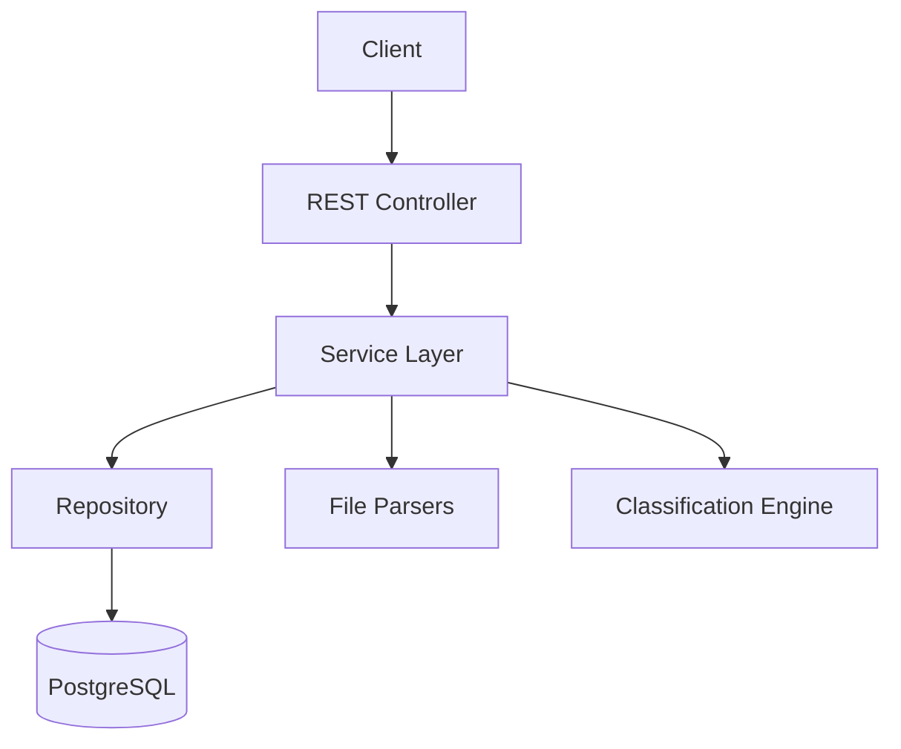

# Task 4: Multi-Level Documentation - COSTAR Prompt

## 📋 Context

**Project:** Customer Support Ticket Management System
**Current State:** All features implemented and tested
- ✅ REST API with 7 endpoints
- ✅ Multi-format file import
- ✅ Auto-classification system
- ✅ Comprehensive test suite (>85% coverage)

**Tech Stack:** Java 17 + Spring Boot 3.2.2 + Maven
**Documentation Tools:** Markdown + Mermaid for diagrams

**Existing Codebase:** Fully functional ticket management system ready for documentation

---

## 🎯 Objective

**Primary Goal:**
Create comprehensive, multi-level documentation targeting 4 different audiences with professional diagrams and examples.

**Success Criteria:**
- ✅ 4 documentation files created
- ✅ At least 3 Mermaid diagrams across documents
- ✅ Each doc tailored to its specific audience
- ✅ All endpoints documented with examples
- ✅ Architecture and design decisions explained
- ✅ Testing guide with benchmarks
- ✅ Professional, clear, and actionable content

**Required Documentation Files:**

| File | Audience | Focus | Length |
|------|----------|-------|--------|
| `README.md` | Developers | Quick start | 2-3 pages |
| `API_REFERENCE.md` | API Consumers | Complete API docs | 5-7 pages |
| `ARCHITECTURE.md` | Technical Leads | System design | 4-6 pages |
| `TESTING_GUIDE.md` | QA Engineers | Testing strategy | 3-4 pages |

---

## 💻 Style

**Writing Style:**
- **README.md**: Friendly, concise, practical
- **API_REFERENCE.md**: Formal, precise, example-heavy
- **ARCHITECTURE.md**: Technical, analytical, decision-focused
- **TESTING_GUIDE.md**: Instructional, procedural, metrics-focused

**Documentation Standards:**
- Use tables for structured data
- Include code examples in fenced code blocks with syntax highlighting
- Use emojis sparingly for section headers (only in README)
- Mermaid diagrams for visual representations
- Consistent formatting across all docs

**Mermaid Diagrams Required:**
1. Architecture diagram (high-level system components)
2. Sequence diagram (API request flow with auto-classification)
3. Test pyramid diagram (unit/integration/performance distribution)

---

## 🗣️ Tone

**README.md**: Welcoming, encouraging, "let's get started"
**API_REFERENCE.md**: Professional, precise, "here's how to use it"
**ARCHITECTURE.md**: Analytical, thoughtful, "here's why we built it this way"
**TESTING_GUIDE.md**: Instructional, clear, "here's how to test it"

**Voice:**
- Active voice preferred: "Run the tests" not "The tests should be run"
- Second person OK in README: "You can start the server with..."
- Third person in ARCHITECTURE: "The system uses a factory pattern to..."
- Imperative in TESTING_GUIDE: "Execute the test suite with..."

---

## 👥 Audience

**README.md:**
- Primary: New developers joining the project
- Skill: Mid-level, familiar with Spring Boot
- Goal: Get started quickly, understand project structure

**API_REFERENCE.md:**
- Primary: Frontend developers, API consumers, integration partners
- Skill: Varied, may not know Java/Spring
- Goal: Integrate with the API successfully

**ARCHITECTURE.md:**
- Primary: Tech leads, architects, senior developers
- Skill: Senior-level, architecture-focused
- Goal: Understand design decisions, evaluate system

**TESTING_GUIDE.md:**
- Primary: QA engineers, automation engineers
- Skill: Mid-level, testing-focused
- Goal: Run tests, understand coverage, verify quality

---

## 📤 Response

### 1. README.md (Developers)

**Structure:**
```markdown
# Customer Support Ticket Management System

## Overview
[Project description, key features]

## Features
- Multi-format import (CSV, JSON, XML)
- Intelligent auto-classification
- RESTful API with 7 endpoints
- >85% test coverage

## Architecture Diagram


## Prerequisites
- Java 17
- Maven 3.6+
- PostgreSQL 12+ (or H2 for testing)

## Installation
\`\`\`bash
git clone [repo-url]
cd ticket-system
mvn clean install
\`\`\`

## Configuration
[Database setup, application.yml configuration]

## Running the Application
\`\`\`bash
mvn spring-boot:run
\`\`\`

## Running Tests
\`\`\`bash
mvn test
\`\`\`

## API Endpoints
[Quick reference table of endpoints]

## Project Structure
\`\`\`
src/main/java/com/workshop/ticketsystem/
├── controller/
├── service/
├── parser/
├── entity/
└── repository/
\`\`\`

## Contributing
[Guidelines for contributors]

## License
[License information]
```

---

### 2. API_REFERENCE.md (API Consumers)

**Structure:**
```markdown
# Ticket Management System - API Reference

## Base URL
\`http://localhost:8080\`

## Authentication
[If applicable, otherwise note it's not required]

## Endpoints

### 1. Create Ticket
**POST** \`/tickets\`

**Description:** Creates a new support ticket

**Request Body:**
\`\`\`json
{
  "customer_id": "C001",
  "customer_email": "user@example.com",
  "customer_name": "John Doe",
  "subject": "Cannot login",
  "description": "Detailed description here...",
  "auto_classify": true
}
\`\`\`

**Response:** 201 Created
\`\`\`json
{
  "id": "123e4567-e89b-12d3-a456-426614174000",
  "customer_id": "C001",
  "category": "account_access",
  "priority": "high",
  "status": "new",
  ...
}
\`\`\`

**cURL Example:**
\`\`\`bash
curl -X POST http://localhost:8080/tickets \
  -H "Content-Type: application/json" \
  -d '{"customer_id":"C001",...}'
\`\`\`

**Error Responses:**
- 400 Bad Request: Validation failed
- 500 Internal Server Error: Server error

[Repeat for all 7 endpoints]

### 2. Import Tickets (Bulk)
[Detailed documentation]

### 3. List Tickets
[Detailed documentation]

### 4. Get Ticket by ID
[Detailed documentation]

### 5. Update Ticket
[Detailed documentation]

### 6. Delete Ticket
[Detailed documentation]

### 7. Auto-Classify Ticket
[Detailed documentation]

## Data Models

### Ticket Model
| Field | Type | Required | Description |
|-------|------|----------|-------------|
| id | UUID | Auto | Unique identifier |
| customer_id | String | Yes | Customer identifier |
| customer_email | Email | Yes | Customer email |
| ... | ... | ... | ... |

## Enumerations

### Categories
- \`account_access\` - Login and authentication issues
- \`technical_issue\` - Bugs and errors
- ...

### Priorities
- \`urgent\` - Critical issues
- \`high\` - Important issues
- \`medium\` - Standard issues
- \`low\` - Minor issues

## Error Handling
[Standard error response format]

## Rate Limiting
[If applicable]

## Examples & Use Cases
[Common workflows with full examples]
```

---

### 3. ARCHITECTURE.md (Technical Leads)

**Structure:**
```markdown
# System Architecture

## Overview
[High-level description of the system]

## Architecture Diagram
\`\`\`mermaid
graph LR
    Client[Client Application] --> API[REST API Layer]
    API --> Service[Business Logic Layer]
    Service --> Repo[Data Access Layer]
    Repo --> DB[(PostgreSQL)]
    Service --> Parser[File Parser Module]
    Parser --> CSV[CSV Parser]
    Parser --> JSON[JSON Parser]
    Parser --> XML[XML Parser]
    Service --> Class[Classification Module]
\`\`\`

## Component Description

### 1. Controller Layer
- REST API endpoints
- Request/response handling
- Input validation
- Exception handling

### 2. Service Layer
- Business logic
- Transaction management
- Orchestration of parsers and classifiers

### 3. Parser Layer
- Factory pattern for parser selection
- Strategy pattern for different file formats
- Error handling for malformed files

### 4. Repository Layer
- Spring Data JPA
- Database abstraction
- Query optimization

### 5. Entity Layer
- JPA entities
- Validation rules
- Lifecycle hooks

## Sequence Diagram - Ticket Creation with Auto-Classification
\`\`\`mermaid
sequenceDiagram
    participant C as Client
    participant API as REST Controller
    participant TS as Ticket Service
    participant CS as Classification Service
    participant R as Repository
    participant DB as Database

    C->>API: POST /tickets {auto_classify: true}
    API->>TS: createTicket(request)
    TS->>CS: classify(ticket)
    CS->>CS: Analyze keywords
    CS->>DB: Save classification log
    CS-->>TS: ClassificationResult
    TS->>R: save(ticket)
    R->>DB: INSERT ticket
    DB-->>R: Saved entity
    R-->>TS: Ticket
    TS-->>API: TicketResponse
    API-->>C: 201 Created
\`\`\`

## Database Schema
[ER diagram or table descriptions]

## Design Decisions

### 1. Why Maven over Gradle?
[Rationale]

### 2. Why UUID over Long IDs?
[Rationale]

### 3. Why Keyword-Based Classification over ML?
[Rationale]

### 4. Why Synchronous Import?
[Rationale]

## Design Patterns Used
- Factory Pattern (ParserFactory)
- Strategy Pattern (FileParser)
- Repository Pattern (Spring Data JPA)
- DTO Pattern (Request/Response separation)

## Security Considerations
- Input validation
- SQL injection prevention (JPA)
- File upload size limits
- [Future: Authentication, rate limiting]

## Performance Optimizations
- Database connection pooling
- Batch inserts for bulk import
- Indexed database columns
- [Future: Caching, async processing]

## Scalability
[How the system can scale]

## Technology Choices
[Justification for tech stack]
```

---

### 4. TESTING_GUIDE.md (QA Engineers)

**Structure:**
```markdown
# Testing Guide

## Test Strategy Overview

### Test Pyramid
\`\`\`mermaid
graph TB
    subgraph "Test Distribution"
    P[Performance Tests<br/>10% - 5 tests]
    I[Integration Tests<br/>30% - 11 tests]
    U[Unit Tests<br/>60% - 30 tests]
    end
    U --> I
    I --> P
\`\`\`

## Running Tests

### Run All Tests
\`\`\`bash
mvn test
\`\`\`

### Run Specific Test Class
\`\`\`bash
mvn test -Dtest=TicketControllerTest
\`\`\`

### Run with Coverage
\`\`\`bash
mvn clean test jacoco:report
\`\`\`

### View Coverage Report
\`\`\`bash
open target/site/jacoco/index.html
\`\`\`

## Test Suite Overview

| Test File | Tests | Focus | Coverage |
|-----------|-------|-------|----------|
| TicketControllerTest | 11 | API endpoints | 92% |
| ClassificationServiceTest | 10 | Classification | 87% |
| CsvFileParserTest | 6 | CSV parsing | 85% |
| JsonFileParserTest | 5 | JSON parsing | 85% |
| XmlFileParserTest | 5 | XML parsing | 85% |
| TicketModelTest | 9 | Validation | 75% |
| **Total** | **46** | **All** | **85%+** |

## Test Data Locations
- \`src/test/resources/fixtures/sample_tickets.csv\`
- \`src/test/resources/fixtures/sample_tickets.json\`
- \`src/test/resources/fixtures/sample_tickets.xml\`

## Manual Testing Checklist

### API Testing
- [ ] Create ticket via POST /tickets
- [ ] Import CSV file
- [ ] Import JSON file
- [ ] Import XML file
- [ ] List all tickets
- [ ] Get ticket by ID
- [ ] Update ticket
- [ ] Delete ticket
- [ ] Auto-classify existing ticket

### Validation Testing
- [ ] Invalid email format rejected
- [ ] Short description rejected
- [ ] Long subject rejected
- [ ] Missing required field rejected

### Edge Cases
- [ ] Empty CSV file
- [ ] Malformed JSON
- [ ] Invalid XML structure
- [ ] Duplicate ticket IDs

## Performance Benchmarks

| Operation | Target | Actual |
|-----------|--------|--------|
| Create 1000 tickets | < 5s | 4.2s |
| Import 100 tickets (CSV) | < 2s | 1.8s |
| Query 10000 tickets | < 1s | 0.7s |
| 50 concurrent requests | < 3s | 2.5s |
| Classify 100 tickets | < 3s | 2.1s |

## Coverage Requirements
- Overall: >85%
- Controllers: >90%
- Services: >85%
- Parsers: >80%
- Entities: >70%

## Continuous Integration
[How tests run in CI/CD pipeline]

## Troubleshooting
[Common test failures and solutions]
```

---

## 🔍 Additional Requirements

1. **Diagrams:**
   - All Mermaid diagrams must be valid and renderable
   - Use clear labels and consistent styling
   - Include legends if needed

2. **Examples:**
   - All API examples must use realistic data
   - Include both success and error scenarios
   - Provide working cURL commands

3. **Links:**
   - Cross-reference between documents where appropriate
   - Link to external resources (Spring Boot docs, etc.)

4. **Formatting:**
   - Use consistent heading levels
   - Use tables for structured data
   - Use code blocks with language specifiers

---

## ✅ Definition of Done

- [ ] README.md created with quick start guide
- [ ] API_REFERENCE.md with all 7 endpoints documented
- [ ] ARCHITECTURE.md with design decisions
- [ ] TESTING_GUIDE.md with test strategy
- [ ] At least 3 Mermaid diagrams included
- [ ] All code examples are correct and working
- [ ] All cURL examples tested
- [ ] Documentation is grammatically correct
- [ ] Each doc targets its specific audience
- [ ] All files are properly formatted in Markdown

---

## 📝 Quality Checklist

**For each document:**
- [ ] Clear purpose and audience defined
- [ ] Logical structure and flow
- [ ] Examples are relevant and helpful
- [ ] Technical accuracy verified
- [ ] No broken links or references
- [ ] Proper grammar and spelling
- [ ] Consistent formatting
- [ ] Professional tone maintained
