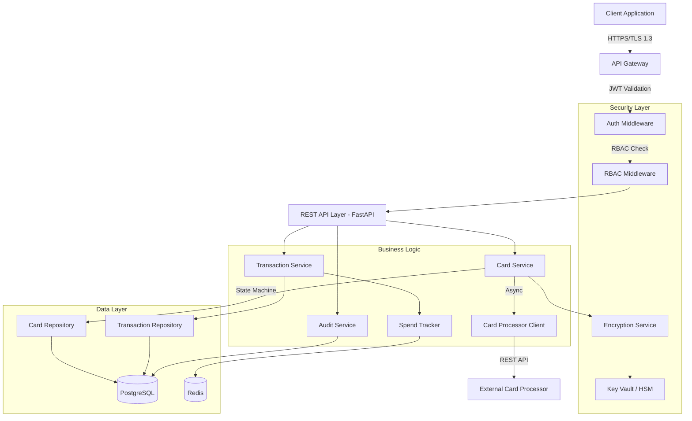
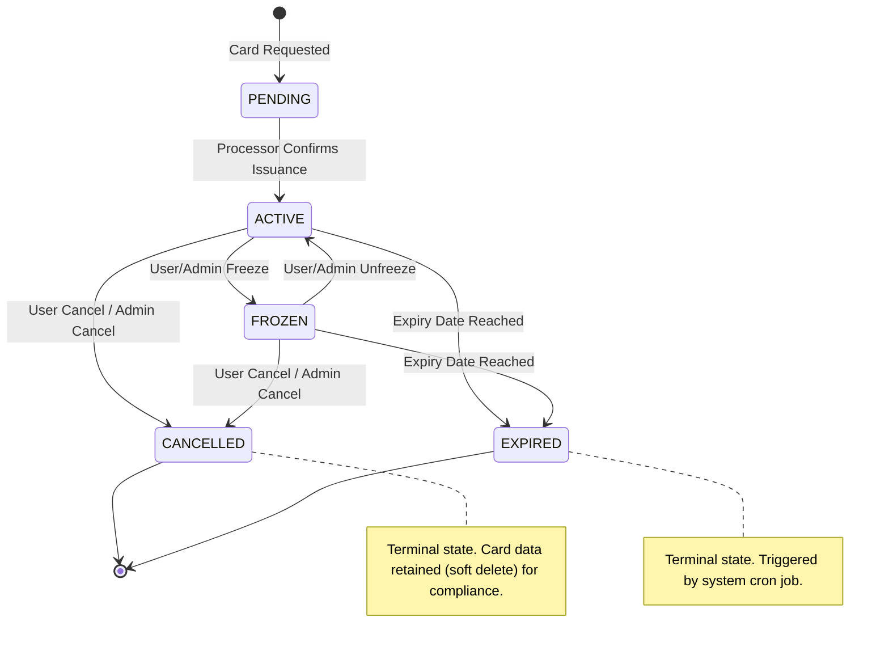

# Virtual Card Lifecycle Management System Specification

> Ingest the information from this file, implement the Low-Level Tasks, and generate the code that will satisfy the High and Mid-Level Objectives.

## High-Level Objective
- Build a secure, compliant virtual card lifecycle management system that enables users to create, manage, freeze/unfreeze, set spending limits, and view transactions for virtual payment cards in a regulated financial environment.

## Mid-Level Objectives
- **Compliance & Regulatory**: Implement PCI-DSS Level 1 compliant card data handling with full audit trails and GDPR-compliant data retention
- **Security & Access Control**: Enforce role-based access control (RBAC) with multi-factor authentication for sensitive operations and end-to-end encryption for card data
- **Card Lifecycle Operations**: Provide complete card management (create, activate, freeze/unfreeze, set limits, cancel, replace) with state machine validation
- **Transaction Management**: Enable real-time transaction viewing, filtering, and export with spend tracking against configured limits
- **Audit & Monitoring**: Maintain immutable audit logs for all operations with real-time fraud detection alerts and compliance reporting

## System Architecture

## Card Lifecycle State Machine

### Allowed State Transitions

| Current State | Allowed Target States | Trigger |
|---|---|---|
| PENDING | ACTIVE | Card processor confirms issuance |
| ACTIVE | FROZEN, CANCELLED, EXPIRED | User action / system expiry |
| FROZEN | ACTIVE, CANCELLED, EXPIRED | User action / system expiry |
| CANCELLED | _(terminal)_ | N/A |
| EXPIRED | _(terminal)_ | N/A |

## API Endpoints Summary

| Method | Endpoint | Description | Auth | Idempotent |
|---|---|---|---|---|
| `POST` | `/api/v1/cards` | Create a new virtual card | CARDHOLDER, ACCOUNT_ADMIN | Yes |
| `GET` | `/api/v1/cards/{card_id}` | Get card details (masked PAN) | CARDHOLDER (own), SUPPORT_AGENT, ADMIN | No |
| `POST` | `/api/v1/cards/{card_id}/freeze` | Freeze an active card | CARDHOLDER (own), ACCOUNT_ADMIN | Yes |
| `POST` | `/api/v1/cards/{card_id}/unfreeze` | Unfreeze a frozen card | CARDHOLDER (own), ACCOUNT_ADMIN | Yes |
| `PATCH` | `/api/v1/cards/{card_id}/limits` | Update spending limits | CARDHOLDER (own, MFA if increase), ADMIN | Yes |
| `DELETE` | `/api/v1/cards/{card_id}` | Cancel card (soft delete) | CARDHOLDER (own, MFA), ACCOUNT_ADMIN | Yes |
| `POST` | `/api/v1/cards/{card_id}/replace` | Issue replacement card | CARDHOLDER (own), ACCOUNT_ADMIN | Yes |
| `GET` | `/api/v1/cards/{card_id}/transactions` | List transactions (paginated) | CARDHOLDER (own), SUPPORT_AGENT | No |
| `GET` | `/api/v1/cards/{card_id}/transactions/{txn_id}` | Get single transaction detail | CARDHOLDER (own), SUPPORT_AGENT | No |
| `GET` | `/api/v1/cards/{card_id}/transactions/export` | Export transactions (CSV/PDF) | CARDHOLDER (own) | No |
| `GET` | `/api/v1/cards/{card_id}/spend-summary` | Get aggregated spend data | CARDHOLDER (own), ACCOUNT_ADMIN | No |

## RBAC Permission Matrix

| Permission | CARDHOLDER | ACCOUNT_ADMIN | SUPPORT_AGENT | COMPLIANCE_OFFICER |
|---|---|---|---|---|
| card.create | own | account-wide | - | - |
| card.view | own | account-wide | all (masked) | all (audit only) |
| card.freeze / unfreeze | own | account-wide | - | - |
| card.cancel | own (MFA) | account-wide | - | - |
| card.update_limits | own (MFA if increase) | account-wide | - | - |
| transactions.view | own | account-wide | all (masked) | - |
| transactions.export | own | account-wide | - | - |
| audit.view | - | - | - | all |
| audit.export | - | - | - | all |

## Implementation Notes
- **Monetary Calculations**: Use `Decimal(19,4)` for all monetary amounts; never use floating-point arithmetic; use `ROUND_HALF_UP`
- **Data Privacy**: Implement field-level encryption (AES-256-GCM) for PAN, CVV, and cardholder data per PCI-DSS requirements
- **Audit Requirements**: Log all operations with timestamp, user ID, IP address, action type, before/after state as JSON
- **Error Handling**: Return standardized error codes; never expose internal system details or sensitive data in error messages
- **Input Validation**: Sanitize and validate all inputs via Pydantic; enforce strict type checking and range validation for amounts
- **Idempotency**: All state-changing operations must accept `Idempotency-Key` header; store keys in Redis with 24h TTL
- **Rate Limiting**: Per-user (60 reads/min, 10 writes/min) and per-IP rate limits via Redis sliding window
- **Testing**: Unit, integration, security, and compliance tests; minimum 90% coverage on critical paths, 80% overall
- **Concurrency**: Use `SELECT FOR UPDATE` row-level locking for all state-changing card operations

## Context

### Beginning context
- Empty project structure requiring full implementation
- PostgreSQL 15+ database available for persistent storage
- Redis 7+ available for caching and rate limiting
- Authentication service available (OAuth 2.0 + JWT with RS256)
- Encryption service available (AES-256-GCM via `cryptography` library)
- Audit logging service available
- Third-party card processor API available (sandbox environment)

### Ending context
| Artifact | Path | Description |
|---|---|---|
| API application | `src/` | FastAPI app with all endpoints, services, models |
| Database migrations | `migrations/` | Alembic migration files for PostgreSQL schema |
| Test suite | `tests/` | Unit, integration, security, compliance tests |
| API documentation | `openapi.yaml` | OpenAPI 3.0 specification |
| Operations runbook | `docs/operations_runbook.md` | Deployment, monitoring, troubleshooting |
| Compliance docs | `docs/compliance_checklist.md` | PCI-DSS / GDPR mapping |
| Incident response | `docs/incident_response_plan.md` | Security breach procedures |
| Deployment config | `Dockerfile`, `docker-compose.yml`, `k8s/` | Container and orchestration config |
| CI/CD pipeline | `.github/workflows/ci-cd.yml` | Automated test, build, deploy |
| Monitoring | `monitoring/prometheus.yml` | Metrics and alerting config |

## Low-Level Tasks

### 1. Database Schema and Models

**What prompt would you run to complete this task?**
Create database schema and ORM models for virtual card lifecycle management with full audit support. Include proper constraints, indexes, and encryption specifications for sensitive fields.

**What file do you want to CREATE or UPDATE?**
- `src/models/card.py`
- `src/models/transaction.py`
- `src/models/audit_log.py`
- `migrations/001_initial_schema.sql`

**What function do you want to CREATE or UPDATE?**
- `Card` model class with fields: id, user_id, card_number_encrypted, cvv_encrypted, status, spending_limit, daily_limit, monthly_limit, expiry_date, created_at, updated_at
- `Transaction` model class with fields: id, card_id, amount, currency, merchant_name, merchant_category, status, timestamp, metadata
- `AuditLog` model class with fields: id, entity_type, entity_id, user_id, action, before_state, after_state, ip_address, timestamp

**What are details you want to add to drive the code changes?**
- Use UUID for all primary keys
- Add composite indexes on (user_id, status) and (card_id, timestamp) for performance
- Implement soft delete pattern (deleted_at field) for GDPR compliance
- Card status must be ENUM: PENDING, ACTIVE, FROZEN, CANCELLED, EXPIRED
- All monetary fields must use Decimal(19,4) type
- created_at and updated_at must be UTC timestamps with automatic updates
- Add foreign key constraints with ON DELETE RESTRICT for data integrity
- Implement check constraints for positive amounts and valid date ranges
- Add unique constraint on card_number_encrypted to prevent duplicates

### 2. Card Management Service Layer

**What prompt would you run to complete this task?**
Implement the core card management service with state machine validation, business rules enforcement, and integration with encryption and card processor services. Ensure all operations are idempotent and maintain audit trails.

**What file do you want to CREATE or UPDATE?**
- `src/services/card_service.py`
- `src/services/card_processor_client.py`
- `src/validators/card_validators.py`

**What function do you want to CREATE or UPDATE?**
- `create_card(user_id, card_type, spending_limits, idempotency_key)` - Creates new virtual card with validation
- `freeze_card(card_id, user_id, reason, idempotency_key)` - Freezes active card
- `unfreeze_card(card_id, user_id, idempotency_key)` - Unfreezes frozen card
- `update_spending_limits(card_id, user_id, new_limits, idempotency_key)` - Updates card limits
- `cancel_card(card_id, user_id, reason, idempotency_key)` - Permanently cancels card
- `replace_card(card_id, user_id, reason, idempotency_key)` - Issues replacement card
- `validate_state_transition(current_status, target_status)` - Validates allowed state transitions

**What are details you want to add to drive the code changes?**
- Implement state machine: PENDING→ACTIVE, ACTIVE↔FROZEN, ACTIVE→CANCELLED, FROZEN→CANCELLED (CANCELLED and EXPIRED are terminal states)
- Validate spending limits: daily_limit ≤ monthly_limit ≤ overall_limit
- Check user authorization before any operation
- Use database transactions with row-level locking (SELECT FOR UPDATE) to prevent race conditions
- Store idempotency keys with 24-hour expiration in Redis
- Call card processor API asynchronously; implement retry logic with exponential backoff
- Return standardized response: {success: bool, card_id: UUID, message: str, error_code: Optional[str]}
- Log all operations to audit service before and after state changes
- Validate card not expired before freeze/unfreeze operations
- Implement soft delete for cancelled cards (retain data for compliance)

### 3. Transaction Service and Query Layer

**What prompt would you run to complete this task?**
Implement transaction retrieval, filtering, and spend tracking service with real-time limit validation and export capabilities. Include pagination, caching, and compliance-friendly data masking.

**What file do you want to CREATE or UPDATE?**
- `src/services/transaction_service.py`
- `src/services/spend_tracker.py`
- `src/utils/data_masking.py`

**What function do you want to CREATE or UPDATE?**
- `get_transactions(card_id, user_id, filters, pagination)` - Retrieves filtered transaction list
- `get_transaction_details(transaction_id, user_id)` - Returns single transaction details
- `export_transactions(card_id, user_id, format, date_range)` - Exports transactions (CSV/PDF)
- `check_spending_limit(card_id, amount, period)` - Validates transaction against limits
- `calculate_spend_summary(card_id, period)` - Returns aggregated spend data
- `mask_card_number(card_number)` - Masks PAN for display (shows only last 4 digits)

**What are details you want to add to drive the code changes?**
- Implement pagination with cursor-based approach for large datasets (page_size max 100)
- Support filters: date_range, amount_range, merchant_name, merchant_category, status
- Cache transaction lists in Redis with 5-minute TTL; invalidate on new transactions
- Mask full card number except last 4 digits in all API responses
- Real-time spend calculation: query sum of successful transactions for current day/month
- Reject transactions exceeding configured limits before processing
- Export format: CSV (machine-readable), PDF (human-readable with masked data)
- Include transaction metadata: merchant MCC code, geographic location, auth/settlement timestamps
- Implement rate limiting: 60 requests/minute per user for transaction queries
- Return spend summary: {total_spent: Decimal, transaction_count: int, limit: Decimal, remaining: Decimal}

### 4. Authentication and Authorization Middleware

**What prompt would you run to complete this task?**
Implement RBAC middleware with JWT validation, scope-based authorization, and audit logging for all access attempts. Enforce principle of least privilege and separation of duties.

**What file do you want to CREATE or UPDATE?**
- `src/middleware/auth_middleware.py`
- `src/middleware/rbac_middleware.py`
- `src/models/user_roles.py`

**What function do you want to CREATE or UPDATE?**
- `validate_jwt_token(token)` - Validates JWT signature and expiration
- `check_permission(user_id, resource, action)` - Verifies user has required permission
- `require_mfa(operation)` - Decorator enforcing MFA for sensitive operations
- `log_access_attempt(user_id, resource, action, success)` - Logs all authorization attempts

**What are details you want to add to drive the code changes?**
- Define roles: CARDHOLDER (own cards only), ACCOUNT_ADMIN (all cards in account), SUPPORT_AGENT (read-only, masked data), COMPLIANCE_OFFICER (full audit access)
- Implement permissions: card.create, card.view, card.freeze, card.cancel, card.update_limits, transactions.view, audit.view
- CARDHOLDER can only access their own cards; validate user_id matches card.user_id
- SUPPORT_AGENT can view cards but receives masked data (partial PAN, no CVV)
- Require MFA for: card.cancel, card.update_limits (if increasing limits)
- Extract user_id and roles from JWT claims; validate issuer and audience
- Log failed authorization attempts with user_id, IP, attempted action, timestamp
- Implement session timeout: 15 minutes for CARDHOLDER, 30 minutes for others
- Return 401 for authentication failures, 403 for authorization failures with generic messages
- Add security headers: X-Content-Type-Options, X-Frame-Options, Strict-Transport-Security

### 5. API Endpoints and Input Validation

**What prompt would you run to complete this task?**
Create RESTful API endpoints with comprehensive input validation, standardized error handling, and OpenAPI documentation. Implement request/response logging for audit purposes.

**What file do you want to CREATE or UPDATE?**
- `src/api/cards.py`
- `src/api/transactions.py`
- `src/validators/request_validators.py`
- `src/api/error_handlers.py`

**What function do you want to CREATE or UPDATE?**
- `POST /api/v1/cards` - Create new card
- `GET /api/v1/cards/{card_id}` - Get card details
- `POST /api/v1/cards/{card_id}/freeze` - Freeze card
- `POST /api/v1/cards/{card_id}/unfreeze` - Unfreeze card
- `PATCH /api/v1/cards/{card_id}/limits` - Update spending limits
- `DELETE /api/v1/cards/{card_id}` - Cancel card
- `GET /api/v1/cards/{card_id}/transactions` - Get transactions
- `validate_create_card_request(request_body)` - Validates card creation input
- `validate_limits_request(request_body)` - Validates spending limits input

**What are details you want to add to drive the code changes?**
- All endpoints require Authorization header with Bearer token
- Validate Content-Type: application/json for POST/PATCH requests
- Implement idempotency: Accept Idempotency-Key header for state-changing operations
- Input validation rules:
  - card_type: required, ENUM(VIRTUAL_SINGLE_USE, VIRTUAL_MULTI_USE)
  - spending_limit: required, Decimal > 0, max 1000000.00
  - daily_limit: optional, Decimal > 0, must be ≤ monthly_limit
  - monthly_limit: optional, Decimal > 0, must be ≤ spending_limit
- Standardized error responses: {error_code: str, message: str, details: Optional[object], trace_id: UUID}
- HTTP status codes: 200 (success), 201 (created), 400 (validation error), 401 (unauthorized), 403 (forbidden), 404 (not found), 409 (conflict), 429 (rate limit), 500 (internal error)
- Log all requests: method, path, user_id, ip_address, request_id, response_status, duration
- Include rate limit headers: X-RateLimit-Limit, X-RateLimit-Remaining, X-RateLimit-Reset
- OpenAPI documentation: include examples, schema definitions, security requirements

### 6. Security Implementation

**What prompt would you run to complete this task?**
Implement field-level encryption for sensitive card data, secure key management, and security monitoring. Ensure PCI-DSS compliance for card data storage and transmission.

**What file do you want to CREATE or UPDATE?**
- `src/security/encryption_service.py`
- `src/security/key_manager.py`
- `src/security/security_monitor.py`

**What function do you want to CREATE or UPDATE?**
- `encrypt_card_data(plaintext_data, key_id)` - Encrypts sensitive fields using AES-256-GCM
- `decrypt_card_data(encrypted_data, key_id)` - Decrypts sensitive fields
- `rotate_encryption_key(old_key_id, new_key_id)` - Rotates encryption keys
- `detect_suspicious_activity(user_id, action, context)` - Monitors for fraud patterns
- `hash_idempotency_key(key)` - Securely hashes idempotency keys

**What are details you want to add to drive the code changes?**
- Use AES-256-GCM for encryption; store IV (Initialization Vector) with ciphertext
- Encrypt fields: card_number, cvv, cardholder_name, billing_address
- Never log or display decrypted card data; use masked versions only
- Implement key hierarchy: Master Key (HSM-stored) → Data Encryption Keys (rotated quarterly)
- Store encrypted data format: version:key_id:iv:ciphertext:tag (base64 encoded)
- Key rotation: re-encrypt data in background process; maintain dual-key decryption during transition
- Suspicious activity patterns: rapid freeze/unfreeze cycles, limit increases from unusual IP, multiple failed auth attempts
- Alert on: unusual transaction patterns, access from new geographic regions, bulk data access
- Hash idempotency keys before storage using SHA-256 to prevent key leakage
- Implement secrets management: load encryption keys from secure vault (HashiCorp Vault/AWS KMS)

### 7. Audit Logging and Compliance

**What prompt would you run to complete this task?**
Implement comprehensive audit logging system with immutable logs, compliance report generation, and data retention policies. Support regulatory inquiry workflows.

**What file do you want to CREATE or UPDATE?**
- `src/services/audit_service.py`
- `src/reports/compliance_reports.py`
- `src/utils/data_retention.py`

**What function do you want to CREATE or UPDATE?**
- `log_audit_event(entity_type, entity_id, action, user_id, before_state, after_state, metadata)` - Creates immutable audit entry
- `generate_compliance_report(report_type, date_range)` - Generates regulatory reports
- `apply_retention_policy(entity_type, cutoff_date)` - Archives/deletes data per retention rules
- `export_audit_trail(entity_id, format)` - Exports audit history for specific entity
- `verify_audit_integrity(log_ids)` - Verifies audit log chain integrity

**What are details you want to add to drive the code changes?**
- Audit all operations: CREATE, UPDATE, DELETE, FREEZE, UNFREEZE, CANCEL, VIEW_SENSITIVE_DATA
- Capture context: user_id, session_id, ip_address, user_agent, timestamp (UTC), operation_duration
- Store before/after state as JSON for state-changing operations
- Implement write-once storage: audit logs cannot be modified or deleted (append-only table)
- Create hash chain: each log entry includes hash of previous entry to detect tampering
- Generate reports: PCI-DSS quarterly scan report, GDPR data access report, transaction activity report
- Retention policy: transactions (7 years), audit logs (10 years), personal data (as per GDPR request)
- GDPR compliance: support data subject access requests (DSAR), right to erasure, data portability
- Index audit logs by: entity_id, user_id, timestamp for efficient queries
- Alert compliance team on: unusual data access patterns, bulk exports, privileged operations

### 8. Testing Suite

**What prompt would you run to complete this task?**
Create comprehensive test suite covering unit, integration, security, and compliance testing. Include test fixtures for various scenarios and edge cases.

**What file do you want to CREATE or UPDATE?**
- `tests/unit/test_card_service.py`
- `tests/integration/test_card_lifecycle.py`
- `tests/security/test_encryption.py`
- `tests/compliance/test_audit_trail.py`
- `tests/fixtures/card_fixtures.py`

**What function do you want to CREATE or UPDATE?**
- Unit tests for card_service: test_create_card_success, test_freeze_frozen_card_fails, test_invalid_state_transition
- Integration tests: test_complete_card_lifecycle, test_concurrent_operations, test_limit_enforcement
- Security tests: test_encryption_decryption, test_unauthorized_access, test_sql_injection_prevention
- Compliance tests: test_audit_log_completeness, test_gdpr_data_export, test_pci_dss_data_masking

**What are details you want to add to drive the code changes?**
- Use pytest framework with fixtures for database, Redis, and external service mocks
- Test coverage requirement: minimum 90% for critical paths, 80% overall
- Unit tests: test each function in isolation; mock all external dependencies
- Integration tests: use test database; validate end-to-end workflows
- Security tests: test OWASP Top 10 vulnerabilities (SQL injection, XSS, authentication bypass, IDOR)
- Compliance tests: verify audit log created for each operation, validate data masking rules
- Test edge cases: boundary values for limits, expired cards, concurrent updates, idempotency
- Performance tests: validate API response time <200ms for read operations, <500ms for write operations
- Test data: create fixtures for various card states, user roles, transaction scenarios
- Run tests in CI/CD pipeline; fail build if coverage drops below threshold

### 9. Documentation and Operations

**What prompt would you run to complete this task?**
Create comprehensive documentation including API documentation, runbook for operations team, compliance documentation, and incident response procedures.

**What file do you want to CREATE or UPDATE?**
- `docs/api_documentation.md`
- `docs/operations_runbook.md`
- `docs/compliance_checklist.md`
- `docs/incident_response_plan.md`
- `openapi.yaml`

**What function do you want to CREATE or UPDATE?**
N/A (documentation only)

**What are details you want to add to drive the code changes?**
- API documentation: include all endpoints, request/response examples, error codes, rate limits, authentication
- OpenAPI 3.0 specification: complete schema definitions, security schemes, example requests
- Operations runbook: deployment procedure, monitoring setup, log locations, troubleshooting guide
- Include runbook sections: system architecture, database backup/restore, key rotation procedure, scaling guidelines
- Compliance checklist: PCI-DSS requirements mapping, GDPR compliance verification, audit log validation
- Incident response plan: security breach procedure, data leak response, fraud detection escalation
- Document monitoring alerts: failed transactions rate, API error rate, suspicious activity patterns
- Include contact information: on-call engineer, compliance team, security team
- Disaster recovery: backup strategy, RTO (Recovery Time Objective: 1 hour), RPO (Recovery Point Objective: 5 minutes)
- Environment setup: local development, staging, production configurations

### 10. Deployment Configuration

**What prompt would you run to complete this task?**
Create production-ready deployment configuration with Docker, environment management, CI/CD pipeline, and monitoring setup. Ensure secure configuration management.

**What file do you want to CREATE or UPDATE?**
- `Dockerfile`
- `docker-compose.yml`
- `.env.example`
- `k8s/deployment.yaml`
- `.github/workflows/ci-cd.yml`
- `monitoring/prometheus.yml`

**What function do you want to CREATE or UPDATE?**
N/A (configuration only)

**What are details you want to add to drive the code changes?**
- Dockerfile: multi-stage build, non-root user, minimal base image (python:3.11-slim)
- Environment variables: DATABASE_URL, REDIS_URL, JWT_SECRET, ENCRYPTION_KEY_ID, CARD_PROCESSOR_API_KEY, LOG_LEVEL
- Never commit secrets; use secret management (AWS Secrets Manager, HashiCorp Vault)
- Docker Compose: include services for app, PostgreSQL, Redis, monitoring
- Kubernetes deployment: configure replicas (min 3 for HA), resource limits, health checks, secrets
- Health check endpoints: /health (liveness), /ready (readiness) - check database and Redis connectivity
- CI/CD pipeline: run tests → build Docker image → security scan → deploy to staging → run integration tests → deploy to production
- Monitoring: Prometheus metrics (request rate, error rate, latency percentiles, database connection pool)
- Logging: structured JSON logs with correlation IDs; ship to centralized logging (ELK/Splunk)
- Alerts: API error rate >5%, database connection pool exhausted, memory usage >80%, disk usage >85%
