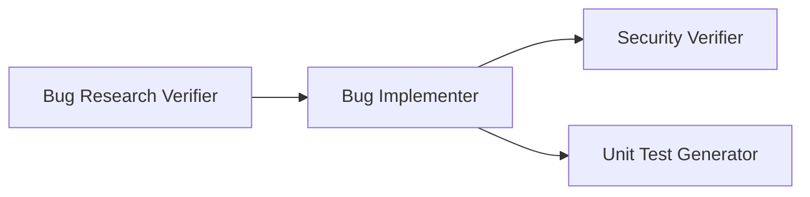

# 🤖 Homework: 4-Agent Pipeline

## 📋 Overview

Build a **4-agent pipeline**: Bug Research Verifier, Bug Implementer, Security Vulnerabilities Verifier, Unit Test Generator (all required). Provide the **application with all 4 agents**, **screenshots**, **all fixes applied**, and **unit tests generated by the agents**.

---

## The 4-Agent Pipeline



**Run order**: Bug Researcher → Bug Research Verifier → Bug Planner → Bug Implementer → Security Verifier (on changed code) → Unit Test Generator (on changed code).

---

## 📝 Tasks

### Task 1: Bug Research Verifier *(Required)* ⭐

**File**: `agents/research-verifier.agent.md`  
**Role**: Fact-checker for Bug Researcher output.

**Responsibilities**: Read `research/codebase-research.md`; verify every file:line reference and that snippets match source; **create result file** `research/verified-research.md` stating **research quality** in a format **defined by a skill** (Task 1.2); document discrepancies.

**1.2 Research quality via skill**: Create a **skill for research quality measurement** (e.g. `skills/research-quality-measurement.md`) that defines levels/labels for research quality. The verifier must use this skill when writing `verified-research.md`. Required sections in result file: Verification Summary (pass/fail, Research Quality per skill), Verified Claims, Discrepancies Found, Research Quality Assessment (level + reasoning), References.

**Success criteria**: Skill created; verifier uses it; result file created with quality per skill; all references verified; discrepancies documented; Bug Planner can use output.

---

### Task 2: Bug Implementer *(Required)* ⭐⭐

**File**: `agents/bug-implementer.agent.md`  
**Role**: Executes implementation plan and documents changes.

**Responsibilities**: Read `implementation-plan.md`; apply changes as specified; run tests after each change; output `fix-summary.md`.

**Process**: (1) Read plan — files, before/after code, test command. (2) Apply changes per file. (3) Run tests; if fail, document and stop. (4) Write fix-summary.md: Changes Made (file, location, before/after, test result), Overall Status, Manual Verification, References.

**Success criteria**: Plan read fully; changes match plan; tests run; fix summary complete; manual verification steps clear.

---

### Task 3: Security Vulnerabilities Verifier *(Required)* ⭐⭐

**File**: `agents/security-verifier.agent.md`  
**Role**: Security review of modified code.

**Responsibilities**: Read `fix-summary.md` and changed files; scan for injection, hardcoded secrets, insecure comparisons, missing validation, unsafe deps, XSS/CSRF where relevant; rate CRITICAL/HIGH/MEDIUM/LOW/INFO; output `security-report.md` only (no code edits).

**Success criteria**: Fix-summary and changed files read; injection/secrets/validation considered; each finding has severity and file:line and remediation; report only.

---

### Task 4: Unit Test Generator *(Required)* ⭐⭐⭐

**File**: `agents/unit-test-generator.agent.md`  
**Role**: Generate and run unit tests for changed code.

**Responsibilities**: Read `fix-summary.md` and changed files; generate tests for new/changed code only; follow project test framework and **FIRST** (Task 4.2); run tests; output `test-report.md`.

**4.2 FIRST skill**: Create skill (e.g. `skills/unit-tests-FIRST.md`) defining **FIRST**: **F**ast, **I**ndependent, **R**epeatable, **S**elf-validating, **T**imely. Unit Test Generator must use this skill. Place in repo and reference from agent.

**Success criteria**: FIRST skill created and used; tests only for changed code; FIRST satisfied; tests run and recorded; test-report and test files submitted.

---

## 📦 Deliverables

| Deliverable | Description |
|-------------|-------------|
| **Source code** | 4 agents in `agents/` + skills: `research-quality-measurement.md` (Task 1.2), `unit-tests-FIRST.md` (Task 4.2) |
| **Working application** | App with all bug fixes applied |
| **Agent outputs** | `verified-research.md`, `fix-summary.md`, `security-report.md`, `test-report.md` (+ plan/research as used) |
| **Screenshots** | In `docs/screenshots/`: pipeline run, fixes, security scan, unit tests |
| **Documentation** | README (overview, how to run pipeline and app), HOWTORUN. Proper README required. |
| **Student file** | e.g. `STUDENT.md` with name and course-requested info |

**Submission**: Proper README; author name; PR with summary, and screenshots; commit agentic folder (agents/, context/, artifacts) to repo.

---

## 📁 Expected Project Structure

```
homework-5/
├── README.md
├── HOWTORUN.md
├── STUDENT.md
├── agents/
│   ├── research-verifier.agent.md
│   ├── bug-implementer.agent.md
│   ├── security-verifier.agent.md
│   └── unit-test-generator.agent.md
├── skills/
│   ├── research-quality-measurement.md
│   └── unit-tests-FIRST.md
├── context/bugs/XXX/
│   ├── bug-context.md
│   ├── research/codebase-research.md, verified-research.md
│   ├── implementation-plan.md
│   ├── fix-summary.md
│   ├── security-report.md
│   └── test-report.md
├── [app source and fixed code]
├── tests/
└── docs/screenshots/
```

---

<div align="center">**Good luck! Submit via the course homework repository as specified in the program.**</div>
